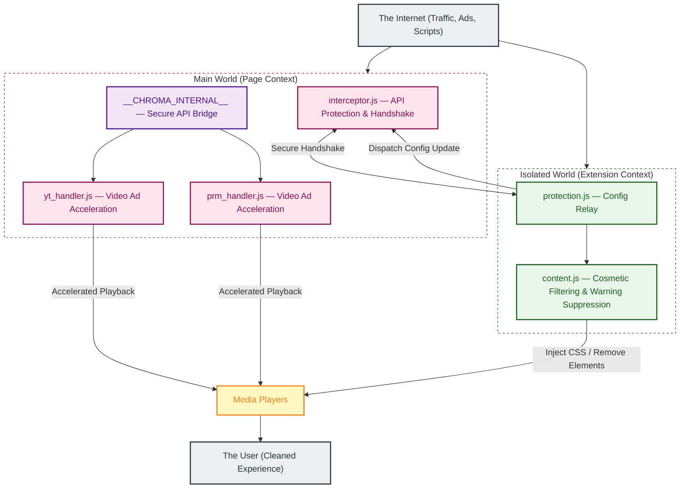
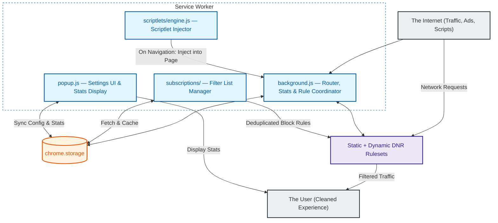

# Chroma Ad-Blocker

**Chroma Ad-Blocker** is a professional-grade, high-performance browser extension built for Manifest V3 (MV3). It employs a sophisticated multi-layered strategy to maintain functionality across a wide range of websites while maintaining a minimal resource footprint. Chroma is free, source-available, and privacy-focused. For optimal performance, it is recommended to disable other ad-blocking extensions while using Chroma.

## Key Features

- **Dynamic Ad Acceleration**: Automatically identifies and accelerates video ads at a configurable speed (×4–×16, default ×8) on YouTube and Amazon Prime Video (Twitch uses server-side ad insertion and does not support ad acceleration), minimizing user interruption with minimal detection exposure.
- **Multi-Part DNR Network Blocking**: Utilizes a 10-part static Declarative Net Request (DNR) ruleset supplemented by runtime dynamic rules, blocking trackers, invasive analytics, and traditional banner ads at the browser engine level.
- **Live Filter List Subscriptions**: Subscribes to external filter lists (Hagezi Pro Mini, Chroma Hotfix) that refresh automatically every 24 hours. Subscription rules are deduplicated against the static ruleset before allocation to maximize coverage within the dynamic rule budget.
- **Scriptlet Injection Engine**: Injects targeted scriptlets into page context on navigation to neutralize anti-adblock scripts, abort property reads, prevent timers, and intercept fetch and XHR calls.
- **Cosmetic Filtering Layer**: Removes ad slots, placeholders, and unwanted UI elements (Shorts, Merch, Offers) via high-speed CSS injection and DOM mutation monitoring.
- **Safety Exclusion Protocol**: Automatically excludes critical infrastructure, including financial institutions, authentication providers, and government domains (.gov) to ensure zero disruption to essential workflows.
- **Security-Hardened Architecture**: Features closure-scoped session state, validated config update pipelines, pristine API caching, and a dead man's switch to prevent host-page interference and script hijacking.
- **Platform Compatibility**: Fully compatible with **Windows**, **macOS**, and **Linux** versions of Google Chrome (and other Chromium-based browsers).

---

## Architecture Overview

Chroma utilizes a multi-layered execution model designed to survive the ephemeral lifecycle of Manifest V3 service workers while maintaining maximum performance and security.

**Diagram 1 — Page Execution Flow**

How Chroma operates inside the browser tab on every page load.

---

**Diagram 2 — Background & Network Flow**

How Chroma manages rules, storage, and network-level blocking from the service worker.

---

## System Layers

### Layer 1: Ad Acceleration (yt_handler.js, prm_handler.js)
The primary defense against server-side ad detection. Instead of blocking the video stream, Chroma accelerates detected ads at a configurable speed (×4–×16, default ×8) and synchronizes with a custom overlay, delivering a seamless experience without intrusive interruptions. Session state is fully private to the handler closure — host-page scripts cannot observe or tamper with acceleration state. Anti-detection exemption rules allow standard ad-measurement beacons to reach their destinations during active ad sessions while suppressing post-session observer floods.

### Layer 2: Network-Level Blocking (rules/, background.js, subscriptions/)
Powered by the Declarative Net Request (DNR) API. Chroma partitions its blocking logic into a 10-part system of static rulesets covering over 299,000 domain-level block rules, augmented by dynamic rules for anti-detection exemptions and runtime filter list subscriptions. Subscription rules are automatically deduplicated against the static ruleset on each refresh, and scored by a priority budget allocator before being applied. The Service Worker coordinates these rulesets and collects blocking statistics.

### Layer 3: Cosmetic & Warning Suppression (content.js)
Utilizes a high-performance MutationObserver and CSS injection via Constructable Stylesheets. This layer hides ad slots, removes unsolicited overlay dialogs that restrict content access based on browser configuration, and cleans up the UI by removing non-video components like Shorts, Merchandise, and Movie/TV offers.

### Layer 4: Scriptlet Injection (scriptlets/engine.js)
On every navigation commit, the scriptlet engine matches the current hostname against stored subscription scriptlet rules and injects matching scriptlet functions directly into the page's MAIN world context via `chrome.scripting.executeScript`. Scriptlets can abort property reads, neutralize anti-adblock timers, intercept fetch and XHR calls, and remove specific CSS classes.

### Layer 5: Universal Protection (protection.js, interceptor.js)
A proactive security layer that maintains extension integrity across execution contexts. `interceptor.js` runs in the Main World to shadow sensitive browser APIs and expose the secure `__CHROMA_INTERNAL__` bridge. `protection.js` reads stored configuration at page load, writes the initialization sentinel to `document.documentElement`, and relays live config updates from the background to the MAIN world handlers via CustomEvent.

---

## Privacy & Transparency

Chroma processes everything locally — no data is ever sent to Chroma's servers because there are none. However, to maintain compatibility with certain websites, Chroma includes a small set of **Allow Rules** that permit specific, standard ad-measurement requests to reach their intended destinations. These rules are scoped exclusively to the supported streaming platform as the initiator domain.

Chroma does not intercept or store any data from these requests. For a full explanation of this tradeoff, see the [Privacy Policy](docs/PRIVACY_POLICY.md).

---

## Security Hardening

Chroma implements several advanced security measures to ensure extension integrity and prevent bypass by third-party scripts:

- **Closure-Scoped Session State**: All session tracking variables in the acceleration handlers are private to the IIFE closure. Host-page scripts cannot read or modify acceleration state, session flags, or ad counters.
- **Config Update Validation**: All incoming configuration updates — whether from the popup or a `__CHROMA_CONFIG_UPDATE__` CustomEvent — are validated against a strict key allowlist with type and range checks. Invalid values are silently rejected before reaching the internal config object.
- **Immutable API Bridge**: Exposes internal utilities via a locked `__CHROMA_INTERNAL__` object. This bridge is protected using `Object.defineProperty` with `writable: false` and `configurable: false`, preventing host pages from hijacking extension logic.
- **Pristine API Caching**: `interceptor.js` captures and freezes native browser APIs (such as `querySelector`, `setTimeout`, and `Function.prototype.toString`) immediately at `document_start`. This ensures that even if a site attempts prototype pollution, the extension operates using trusted, original functions.
- **Dead Man's Switch**: If core native APIs fail integrity checks at startup, the interceptor severs its secure port and falls back to safe defaults rather than operating in a potentially compromised environment.
- **Sentinel Hardening**: The `data-chroma-*` initialization attributes are read exactly once at handler startup. Subsequent writes to those attributes by page scripts have no effect on handler behavior.
- **Session-Token Handshake**: A secure, capture-phase handshake is designed to establish a private communication pipeline between the Main World and the extension background. Sensitive actions require a valid, tab-specific session token.
- **Origin Authentication**: The Background Service Worker strictly validates the origin and sender context of all incoming messages, rejecting sensitive data or configuration requests from outside the extension's verified context.

---

## Quick Start

1. Click **Download Current Version** or get the latest release from [GitHub](https://github.com/Dabrogost/Chroma-Ad-Blocker/releases/latest), and extract the ZIP file.
2. Open `chrome://extensions` in Chrome.
3. Toggle on **Developer Mode** in the top-right corner.
4. Click **Load unpacked** and select the `extension/` folder inside the extracted directory.
5. Done — Chroma is active on all tabs. Pin it from the extensions menu to access the popup.

## Configuration

| Setting | Description | Default |
|---------|-------------|---------|
| `enabled` | Global switch for all features. | `true` |
| `networkBlocking` | Enables DNR ruleset blocking. | `true` |
| `acceleration` | Enables accelerated ad playback. | `true` |
| `accelerationSpeed` | Playback rate multiplier for accelerated ads (×4, ×8, ×12, or ×16). | `8` |
| `cosmetic` | Enables hiding ad placeholders via CSS. | `true` |
| `hideShorts` | Removes Shorts component modules. | `false` |
| `hideMerch` | Removes Merchandise panels. | `true` |
| `hideOffers` | Removes Movie/TV offer modules. | `true` |
| `suppressWarnings` | Removes unsolicited overlay dialogs that restrict content access. | `true` |
| `whitelist` | Toggles blocking for the current domain. | `false` |

---

## AI Usage & Quality Assurance Disclosure

Portions of this codebase, including initial logic structures and documentation, were developed with the assistance of agentic AI coding assistants. To ensure project integrity, every AI-assisted component has been manually audited, refactored, and verified to meet strict security and performance standards. This collaborative approach combines the efficiency of advanced tooling with focused oversight and robust test coverage.

---

## Legal Disclaimers

**Trademark Disclaimer:** YouTube is a trademark of Google LLC. Amazon Prime Video is a trademark of Amazon.com, Inc. Chroma Ad-Blocker is an independent project and is NOT affiliated with, endorsed by, or sponsored by Google LLC, YouTube, Amazon.com, Inc., or any other third-party platform.

**Usage Warning:** Using ad-blockers or ad-acceleration tools may violate the Terms of Service of various platforms. By using Chroma, you acknowledge and assume all risks associated with potential account restrictions or enforcement actions.

---

## Security Policy

For information on how to report security vulnerabilities, please see our [Security Policy](docs/SECURITY.md).

---

## Support the Project

Chroma is a solo project dedicated to restoring the web to its fast, private, and uninterrupted roots. It is 100% free for everyone, forever. If this tool has made your daily browsing a little more colorful, consider supporting this mission.

  <a href="https://github.com/Dabrogost/Chroma-Ad-Blocker">GitHub Repository</a>
   
   
  

  Copyright 2026 Dabrogost

