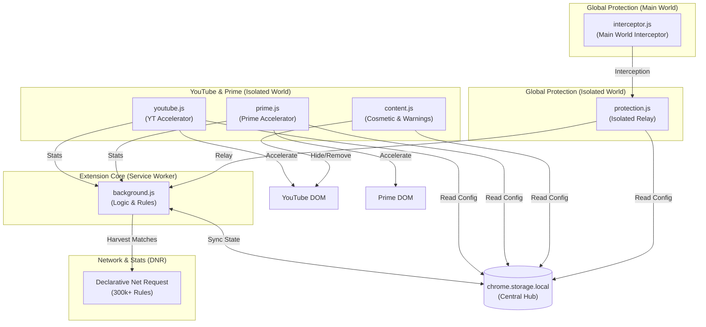

# Chroma Ad-Blocker

**Chroma Ad-Blocker** is a premium, high-performance browser extension built for Manifest V3 (MV3). It employs a sophisticated multi-layered strategy to bypass modern anti-adblock systems while maintaining a lightweight footprint.

## Key Features

- **Multi-Platform Ad Acceleration**: Automatically detects and accelerates ads (up to 16x speed) on **YouTube** and **Amazon Prime Video**. This fulfills server-side impression requirements instantly without triggering ad-block detections.
- **Massive Network Blocking (DNR)**: Utilizes over **300,000+ optimized rules** across 10 rulesets to block trackers, invasive analytics, and traditional banner ads at the browser level.
- **Cosmetic Filtering & Layout Cleanup**: Proactively removes ad placeholders, sidebars, and empty slots.
- **YouTube Power Tools**:
    - **Hide Shorts**: Clean up your feed by removing YouTube Shorts shelves and menu entries.
    - **Hide Merch & Offers**: Suppress intrusive shopping panels and rental/buy offers.
    - **Anti-Adblock Suppression**: Automatically deletes enforcement modals (e.g., "Ad blockers are not allowed") and restores page functionality.
- **Global Privacy Protection**:
    - **Pop-under Blocker**: Intercepts and closes suspicious windows opened without direct user intent.
    - **Push Suppression**: Automatically silences intrusive "Show notifications" prompts from websites.
- **Privacy-First Architecture**: Your data never leaves your device. All stats and settings are stored locally.

---

## Architecture Overview

Chroma uses a decentralized architecture synchronized through `chrome.storage.local`. This ensures that configuration changes and statistics persist across the ephemeral Manifest V3 service worker lifecycle.

---

## System Layers

### Layer 1: Ad Acceleration (`youtube.js`, `prime.js`)
The ultimate defense against server-side ad detection. Instead of blocking the video stream (which triggers warnings), Chroma accelerates ads to 16x speed and mutes them.

### Layer 2: Network-Level Blocking (`rules/`, `background.js`)
Powered by Chrome’s **Declarative Net Request (DNR)** API. Chroma partitions over **300,000 rules** into 10 manageable files to ensure high performance and reliability. The Service Worker handles rule state and periodically harvests block statistics.

### Layer 3: Cosmetic & Warning Suppression (`content.js`, `utils/selectors.js`)
Uses a `MutationObserver` and dynamic CSS injection to hide ad slots, remove "Ad blockers are not allowed" modals, and clean up the YouTube interface (removing Shorts, Merch, and Offers).

### Layer 4: Universal Protection (`protection.js`, `interceptor.js`)
A dual-layer approach to blocking pop-unders and push notifications globally. The `interceptor.js` runs in the **Main World** to shadow browser APIs like `window.open`, while `protection.js` relays events to the background for enforcement.

---

## Quick Start

1. Clone the repository or download the ZIP.
2. Navigate to `chrome://extensions/` in Chrome.
3. Enable **Developer mode** (top right).
4. Click **Load unpacked** and select the extension folder.
5. The extension is now active on all tabs. Settings can be managed via the popup UI.

## Configuration

| Setting | Description | Default |
|---------|-------------|---------|
| `enabled` | Global switch for all features. | `true` |
| `networkBlocking` | Enables DNR rulesets (300k+ rules). | `true` |
| `acceleration` | Enables high-speed ad playback (YT/Prime). | `true` |
| `cosmetic` | Enables hiding ad placeholders via CSS. | `true` |
| `hideShorts` | Removes YouTube Shorts from feed. | `false` |
| `hideMerch` | Removes YouTube Merchandise panels. | `true` |
| `hideOffers` | Removes YouTube Movie/TV offers. | `true` |
| `suppressWarnings` | Removes anti-adblock modals/locks. | `true` |
| `blockPopUnders` | Intercepts unauthorized new windows. | `true` |
| `blockPushNotifications` | Blocks web notification requests. | `true` |

---

## AI Usage & Quality Assurance Disclosure

Portions of this codebase, including initial logic structures and documentation, were developed with the assistance of agentic AI coding assistants. To ensure project integrity, every AI-assisted component has been manually audited, refactored, and verified to meet strict security and performance standards. This collaborative approach combines the efficiency of advanced tooling with focused oversight and robust test coverage.

---

## Support the Project

Chroma is a solo project dedicated to restoring the web to its fast, private, and uninterrupted roots. If this tool has made your daily browsing a little more colorful, consider supporting this mission.

[**Support Chroma on Buy Me a Coffee**](https://buymeacoffee.com/dabrogost)
