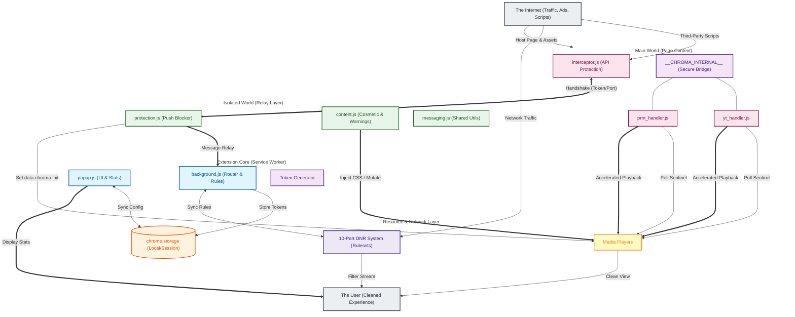

# Chroma Ad-Blocker

**Chroma Ad-Blocker** is a professional-grade, high-performance browser extension built for Manifest V3 (MV3). It employs a sophisticated multi-layered strategy to maintain functionality across a wide range of websites while maintaining a minimal resource footprint. Chroma is free, open-source, and privacy-focused. For optimal performance, it is recommended to disable other ad-blocking extensions while using Chroma.

## Key Features

- **Dynamic Ad Acceleration**: Automatically identifies and accelerates video ads (up to 16x speed) on supported streaming platforms, minimizing user interruption.
- **Multi-Part DNR Network Blocking**: Utilizes a 10-part Declarative Net Request (DNR) system to block trackers, invasive analytics, and traditional banner ads at the browser engine level.
- **Global Component Filtering**:
    - **Push Suppression**: Proactively blocks intrusive native notification and permission prompts.
    - **Cosmetic Layer**: Removes ad slots, placeholders, and unwanted UI elements (Shorts, Merch, Offers) via high-speed CSS injection and DOM mutation monitoring.
- **Safety Exclusion Protocol**: Automatically excludes critical infrastructure, including financial institutions (Banks), authentication providers, and government domains (.gov) to ensure zero disruption to essential workflows.
- **Security-Hardened Architecture**: Features a session-token gated communication pipeline and pristine API caching to prevent host-page interference and script hijacking.
- **Platform Compatibility**: Fully compatible with **Windows**, **macOS**, and **Linux** versions of Google Chrome (and other Chromium-based browsers).

---

## Architecture Overview

Chroma utilizes a multi-layered execution model designed to survive the ephemeral lifecycle of Manifest V3 service workers while maintaining maximum performance and security.

---

## System Layers

### Layer 1: Ad Acceleration (yt_handler.js, prm_handler.js)
The primary defense against server-side ad detection. Instead of blocking the video stream, Chroma accelerates detected ads to 16x speed and synchronizes with a custom overlay, delivering a seamless experience without intrusive interruptions.

### Layer 2: Network-Level Blocking (rules/, background.js)
Powered by the Declarative Net Request (DNR) API. Chroma partitions its blocking logic into a 10-part system of static rulesets, augmented by dynamic rules loaded at runtime for rapid response to new ad domains. The Service Worker coordinates these rulesets and collects blocking statistics.

### Layer 3: Cosmetic & Warning Suppression (content.js)
Utilizes a high-performance MutationObserver and CSS injection via Constructable Stylesheets. This layer hides ad slots, removes unsolicited overlay dialogs that restrict content access based on browser configuration, and cleans up the UI by removing non-video components like Shorts, Merchandise, and Movie/TV offers.

### Layer 4: Universal Protection (protection.js, interceptor.js)
A proactive security layer that blocks intrusive push notification requests and permission prompts globally. The `interceptor.js` runs in the Main World to shadow sensitive browser APIs, while `protection.js` relays events to the extension background for enforcement via a secure pipeline.

---

## Privacy & Transparency

Chroma processes everything locally — no data is ever sent to Chroma's servers because there are none. However, to maintain compatibility with certain websites, Chroma includes a small set of **Allow Rules** that permit specific, standard ad-measurement requests to reach their intended destinations. These rules are scoped exclusively to the streaming provider as the initiator domain.

Chroma does not intercept or store any data from these requests. For a full 
explanation of this tradeoff, see the [Privacy Policy](docs/PRIVACY_POLICY.md).

---

### Security Hardening

Chroma implements several advanced security measures to ensure extension integrity and prevent bypass by third-party scripts:

- **Immutable API Bridge**: Exposes internal utilities via a locked `__CHROMA_INTERNAL__` object. This bridge is protected using `Object.defineProperty` with `writable: false` and `configurable: false`, preventing host pages from hijacking extension logic.
- **Pristine API Caching**: `interceptor.js` captures and freezes native browser APIs (such as `querySelector`, `setTimeout`, and `MutationObserver`) immediately at `document_start`. This ensures that even if a site attempts prototype pollution, the extension operates using trusted, original functions.
- **Session-Token Handshake**: A secure, capture-phase handshake establishes a private communication pipeline between the Main World and the extension background. Sensitive actions (like notification blocking reports) require a valid, tab-specific session token.
- **Origin Authentication**: The Background Service Worker strictly validates the origin and sender context of all incoming messages, rejecting sensitive data or configuration requests from outside the extension's verified context.

---

## Quick Start

1. Download the repository as a ZIP or clone it locally.
2. Navigate to `chrome://extensions` in your browser.
3. Enable "Developer mode" in the upper-right corner.
4. Click "Load unpacked" and select the `extension/` directory.
5. Chroma is now active. You can manage settings and view stats via the extension popup.

## Configuration

| Setting | Description | Default |
|---------|-------------|---------|
| `enabled` | Global switch for all features. | `true` |
| `networkBlocking` | Enables DNR ruleset blocking. | `true` |
| `acceleration` | Enables 16x ad playback. | `true` |
| `cosmetic` | Enables hiding ad placeholders via CSS. | `true` |
| `hideShorts` | Removes component modules (Shorts). | `false` |
| `hideMerch` | Removes Merchandise panels. | `true` |
| `hideOffers` | Removes Movie/TV offer modules. | `true` |
| `suppressWarnings` | Removes unsolicited overlay dialogs that restrict content access. | `true` |
| `blockPushNotifications` | Blocks browser notification prompts. | `true` |
| `whitelist` | Toggles blocking for the current domain. | `false` |

---

## AI Usage & Quality Assurance Disclosure

Portions of this codebase, including initial logic structures and documentation, were developed with the assistance of agentic AI coding assistants. To ensure project integrity, every AI-assisted component has been manually audited, refactored, and verified to meet strict security and performance standards. This collaborative approach combines the efficiency of advanced tooling with focused oversight and robust test coverage.

---

## Legal Disclaimers

**Trademark Disclaimer:** YouTube is a trademark of Google LLC. Amazon Prime Video is a trademark of Amazon.com, Inc. Chroma Ad-Blocker is an independent project and is NOT affiliated with, endorsed by, or sponsored by Google LLC, YouTube, Amazon.com, Inc., or any other third-party platform.

**Usage Warning:** Using ad-blockers or ad-acceleration tools may violate the Terms of Service of various platforms. By using Chroma, you acknowledge and assume all risks associated with potential account restrictions or enforcement actions.

---

## Security Policy

For information on how to report security vulnerabilities, please see our [Security Policy](docs/SECURITY.md).

---

## Support the Project

Chroma is a solo project dedicated to restoring the web to its fast, private, and uninterrupted roots. It is 100% free for everyone, forever. If this tool has made your daily browsing a little more colorful, consider supporting this mission.

  <a href="https://github.com/Dabrogost/Chroma-Ad-Blocker">GitHub Repository</a>
   
   
  

  Copyright 2026 Dabrogost

