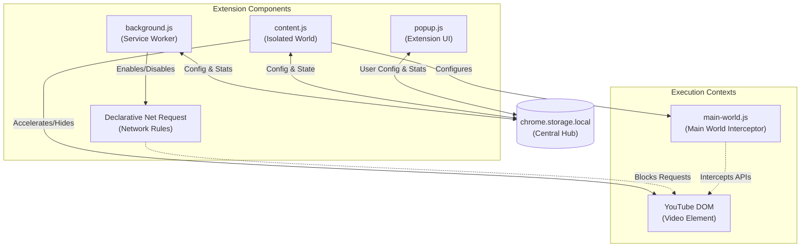

# Chroma Ad-Blocker
**Description:** A multi-layered YouTube-specific ad blocker built for Manifest V3, utilizing ad acceleration, declarative network requests, and cosmetic filtering to bypass modern anti-adblock systems.

## Quick Start
To get Chroma Ad-Blocker running in your Chrome browser:

1. Clone the repository to your local machine:
   ```bash
   git clone https://github.com/Dabrogost/YT-Chroma.git
   ```
2. Open Chrome and navigate to `chrome://extensions/`.
3. Enable **Developer mode** using the toggle in the top right corner.
4. Click **Load unpacked** and select the root directory of the cloned repository.
5. The extension will now be active on all `youtube.com` tabs.

## Architecture Overview
Chroma Ad-Blocker utilizes a decentralized architecture synchronized through a central storage hub. This design ensures that configuration changes and block statistics are consistently applied across various execution contexts (Service Worker, Isolated World, and Main World).



### System Layers
1. **The Data Hub (`chrome.storage.local`)**: The single source of truth for the system. It persists user preferences (acceleration speed, toggle states) and aggregates block statistics, allowing the ephemeral Service Worker to maintain state across restarts.
2. **Layer 1: Ad Acceleration (`content.js`)**: Monitors for the `.ad-showing` class and accelerates playback speed (up to 16x) to fulfill impression requirements invisibly.
3. **Layer 2: Network Blocking (`rules/` & `background.js`)**: Leverages `chrome.declarativeNetRequest` to intercept and block ad-related network requests. The Service Worker dynamically enables or disables these rulesets based on the central hub's configuration.
4. **Layer 3: Cosmetic & Warning Suppression (`content.js`)**: Injects CSS and utilizes a `MutationObserver` to hide ad slots and remove YouTube's anti-adblock modals (`ytd-enforcement-message-view-model`).
5. **Main World Interceptor (`main-world.js`)**: Shadowing sensitive APIs like `window.open` at the page level to prevent pop-under and notification-based advertisements.

## Key Concepts
- **Ad Acceleration**: The primary fallback mechanism. Instead of blocking the video stream (which YouTube's server-side logic can detect), the extension speeds up the ad so it completes in milliseconds.
- **Main World Interceptor**: A script injected directly into the page's execution context to shadow sensitive APIs like `window.open` and `Notification.requestPermission`, allowing for proactive pop-under and push-ad blocking.
- **Service Worker Ephemerality**: In Manifest V3, the background script is a service worker that sleeps when inactive. Chroma Ad-Blocker uses `chrome.storage.local` to ensure configuration and block statistics persist across worker restarts.
- **Stat Harvesting**: In production mode, network block statistics are harvested periodically using `getMatchedRules` since the debug listener is only available during development.

## Configuration
All settings are stored in `chrome.storage.local` and can be toggled via the extension's popup UI.

| Setting | Type | Default | Description |
|---------|------|---------|-------------|
| `enabled` | boolean | `true` | Global switch for all extension features. |
| `networkBlocking` | boolean | `true` | Enables/disables the Declarative Net Request rulesets. |
| `acceleration` | boolean | `true` | Enables/disables high-speed ad playback. |
| `cosmetic` | boolean | `true` | Enables/disables hiding of ad elements via CSS. |
| `suppressWarnings` | boolean | `true` | Actively removes anti-adblock popups and locks. |
| `accelerationSpeed` | number | `16` | The playback rate applied during ad sessions (Max 16). |
| `blockPopUnders` | boolean | `true` | Intercepts and closes suspicious new windows. |
| `blockPushNotifications` | boolean | `true` | Blocks web-push notification permission requests. |

