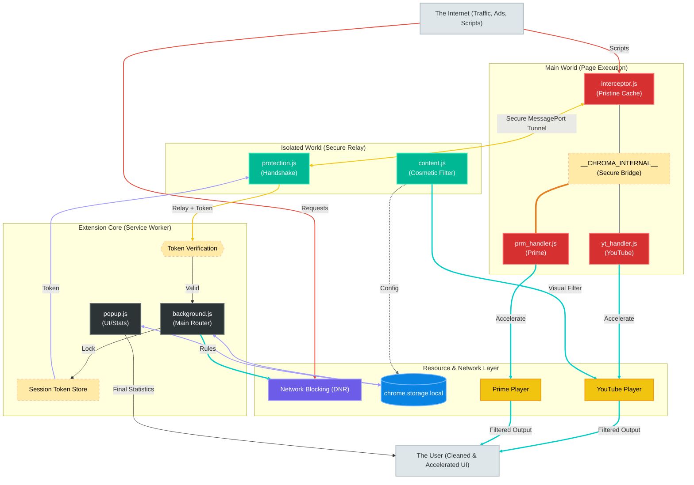

# Chroma Ad-Blocker

**Chroma Ad-Blocker** is a premium, high-performance browser extension built for Manifest V3 (MV3). It employs a sophisticated multi-layered strategy to bypass modern anti-adblock systems while maintaining a lightweight footprint. It is highly recommeneded to disable all other ad-blockers while using Chroma.

## Key Features

- **Multi-Platform Ad Acceleration**: Automatically detects and accelerates ads (up to 16x speed) on **YT** and **Prm**. This fulfills server-side impression requirements instantly without triggering ad-block detections.
- **Massive Network Blocking (DNR)**: Utilizes **300,000 optimized rules** across 10 rulesets to block trackers, invasive analytics, and traditional banner ads at the browser level.
- **Cosmetic Filtering & Layout Cleanup**: Proactively removes ad placeholders, sidebars, and empty slots.
- **YT Power Tools**:
    - **Hide Shorts**: Clean up your feed by removing Shorts shelves and menu entries.
    - **Hide Merch & Offers**: Suppress intrusive shopping panels and rental/buy offers.
    - **Anti-Adblock Suppression**: Automatically deletes enforcement modals (e.g., "Ad blockers are not allowed") and restores page functionality.
- **Global Privacy Protection**:
    - **Pop-under Blocker**: Intercepts and closes suspicious windows opened without direct user intent.
    - **Push Suppression**: Automatically silences intrusive "Show notifications" prompts from websites.
- **Privacy-First Architecture**: Your data never leaves your device. All stats and settings are stored locally.

---

## Architecture Overview

Chroma uses a decentralized architecture synchronized through `chrome.storage.local`. This ensures that configuration changes and statistics persist across the ephemeral Manifest V3 service worker lifecycle.

---

## System Layers

### Layer 1: Ad Acceleration (`yt_handler.js`, `prm_handler.js`)
The ultimate defense against server-side ad detection. Instead of blocking the video stream (which triggers warnings), Chroma accelerates ads to 16x speed and mutes them.

### Layer 2: Network-Level Blocking (`rules/`, `background.js`)
Powered by Chrome’s **Declarative Net Request (DNR)** API. Chroma partitions over **300,000 rules** into 10 manageable files to ensure high performance and reliability. The Service Worker handles rule state and periodically harvests block statistics.

### Layer 3: Cosmetic & Warning Suppression (`content.js`, `utils/selectors.js`)
Uses a `MutationObserver` and dynamic CSS injection to hide ad slots, remove "Ad blockers are not allowed" modals, and clean up the interface (removing Shorts, Merch, and Offers).

### Layer 4: Universal Protection (`protection.js`, `interceptor.js`)
A dual-layer approach to blocking pop-unders and push notifications globally. The `interceptor.js` runs in the **Main World** to shadow browser APIs, while `protection.js` relays events to the background via a **Secure Pipeline** for enforcement.

---

## Security Hardening

Chroma implements several advanced security measures to ensure integrity and prevent bypass by malicious scripts:

- **Immutable API Bridge**: Chroma exposes internal utilities (like `calculateChromaColor`) via a locked `__CHROMA_INTERNAL__` object. This bridge is protected using `Object.defineProperty` with `writable: false` and `configurable: false`, preventing host pages from hijacking or redefining extension-owned logic.
- **Pristine API Caching**: `interceptor.js` captures and freezes native browser APIs (like `querySelector`, `setTimeout`, and `MutationObserver`) at `document_start`. This ensures that even if a site attempts prototype pollution or API tampering, the extension continues to operate using its own "known good" references.
- **Strict Message Whitelisting**: The internal messaging bridge only permits a narrow list of authorized actions (e.g., `STATS_UPDATE`, `CLOSE_TAB`). The Background Service Worker rejects any request that lacks a valid per-tab session token or attempts to execute an unauthorized action.
- **Origin Authentication**: The Background Service Worker strictly validates the origin and sender context of all incoming messages, rejecting any sensitive configuration or statistic requests from outside the extension's own verified context.

---

## Quick Start

1. Download the ZIP from GitHub and extract it (or clone the repo).
2. Open `chrome://extensions` in Chrome.
3. Toggle on **Developer mode** (top-right corner).
4. Click **"Load unpacked"** &rarr; select the `extension/` folder (inside the extracted repo).
5. Done &mdash; Chroma is active on all tabs. Settings can be managed via the popup UI.

## Configuration

| Setting | Description | Default |
|---------|-------------|---------|
| `enabled` | Global switch for all features. | `true` |
| `networkBlocking` | Enables DNR rulesets (300k rules). | `true` |
| `acceleration` | Enables high-speed ad playback (YT/Prm). | `true` |
| `cosmetic` | Enables hiding ad placeholders via CSS. | `true` |
| `hideShorts` | Removes Shorts from feed. | `false` |
| `hideMerch` | Removes Merchandise panels. | `true` |
| `hideOffers` | Removes Movie/TV offers. | `true` |
| `suppressWarnings` | Removes anti-adblock modals/locks. | `true` |
| `blockPopUnders` | Intercepts unauthorized new windows. | `true` |
| `blockPushNotifications` | Blocks web notification requests. | `true` |
| `whitelist` | Toggles blocking for the current active site. | `false` |

---

## AI Usage & Quality Assurance Disclosure

Portions of this codebase, including initial logic structures and documentation, were developed with the assistance of agentic AI coding assistants. To ensure project integrity, every AI-assisted component has been manually audited, refactored, and verified to meet strict security and performance standards. This collaborative approach combines the efficiency of advanced tooling with focused oversight and robust test coverage.

---

## Legal Disclaimers

**Trademark Disclaimer:** YouTube is a trademark of Google LLC. Amazon Prime Video is a trademark of Amazon.com, Inc. Chroma Ad-Blocker is an independent project and is NOT affiliated with, endorsed by, or sponsored by Google LLC, YouTube, Amazon.com, Inc., or any other third-party platform.

**Usage Warning:** Using ad-blockers or ad-acceleration tools may violate the Terms of Service of various platforms. By using Chroma, you acknowledge and assume all risks associated with potential account restrictions or enforcement actions.

---

## Security Policy

For information on how to report security vulnerabilities, please see our [Security Policy](SECURITY.md).

---

## Support the Project

Chroma is a solo project dedicated to restoring the web to its fast, private, and uninterrupted roots. If this tool has made your daily browsing a little more colorful, consider supporting this mission.

  <a href="https://github.com/Dabrogost/Chroma-Ad-Blocker">GitHub Repository</a>

 

  

  Copyright 2026 Dabrogost

