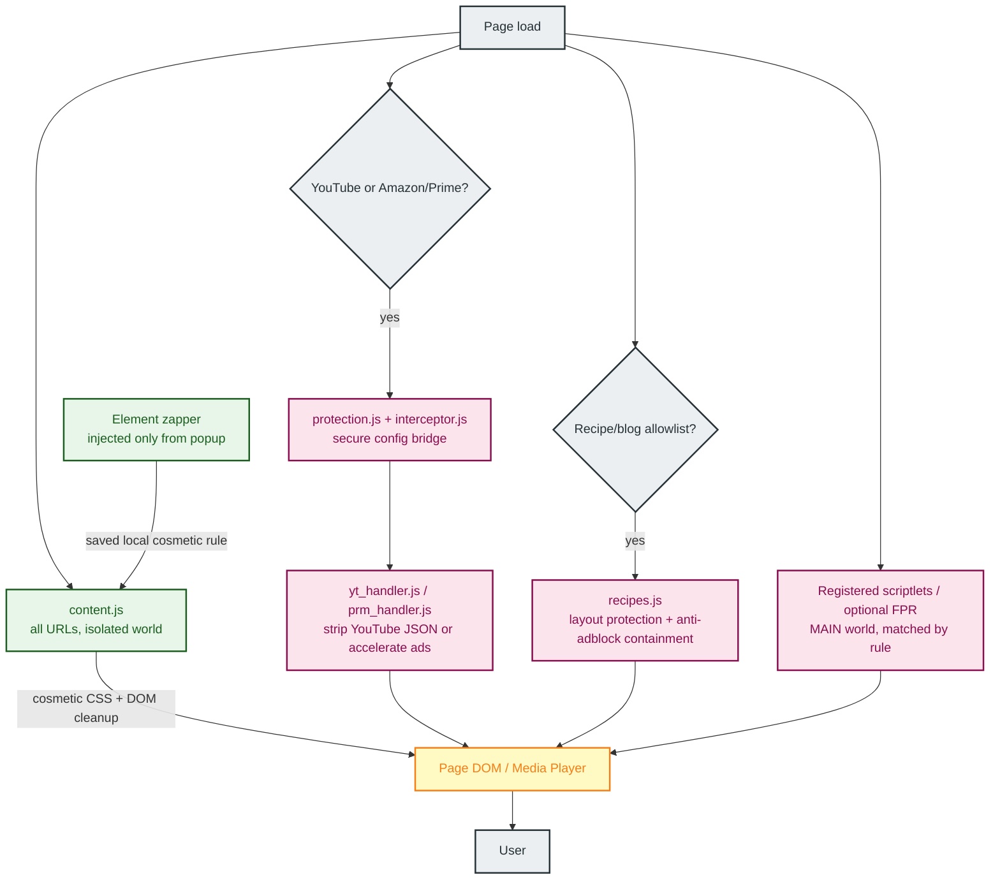
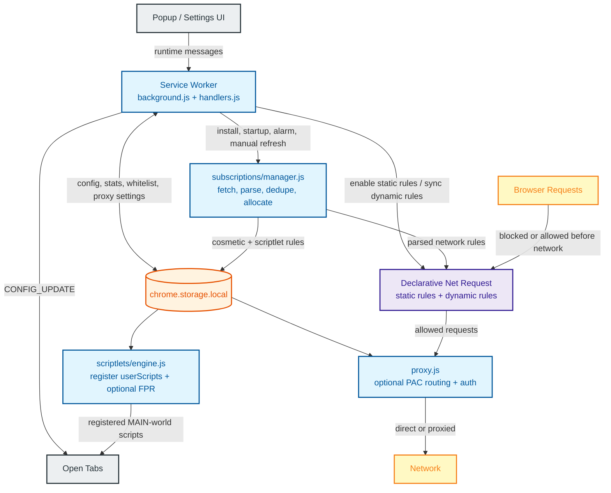

# Chroma Ad-Blocker

**Chroma Ad-Blocker** is an advanced browser extension built for Manifest V3 (MV3). It combines several local protection layers to maintain functionality across a wide range of websites while aiming to keep resource use low. Chroma is free, open-source (GPLv3), and privacy-focused. For best results, it is recommended to disable other ad-blocking extensions while using Chroma.

<div align="center">
  
</div>

## Key Features

- **YouTube Ad Stripping**: Chroma's primary defense against YouTube ads. It intercepts and cleans ad-related metadata from JSON payloads before they reach the player, including sponsored Shorts overlay payloads, providing a seamless, high-performance viewing experience without the need for acceleration.
- **Split-Tunnel Proxy Router**: Allows routing specific domains through a custom HTTP, HTTPS, or SOCKS5 proxy server directly in the browser while leaving all other traffic direct. Includes a **Global Fallback** mode to route all browser traffic while preserving specific domain-to-proxy rules. Proxy credentials are stored locally in an obfuscated form and used only for proxy authentication. Includes real-time connectivity verification.
- **Source-Generated DNR Network Blocking**: Uses a generated OISD Big static Declarative Net Request (DNR) ruleset, a protected custom static layer, and runtime dynamic rules to block trackers, invasive analytics, and traditional banner ads at the browser engine level.
- **Live Filter List Subscriptions**: Subscribes to Hagezi Pro Mini, Chroma Hotfix, EasyList, Fanboy Annoyance, and the bundled Chroma Scriptlet Library, with refresh intervals tuned per list. Subscription rules are deduplicated against the static ruleset before allocation to maximize coverage within the dynamic rule budget.
- **Scriptlet Injection Engine**: A high-performance surgical layer powered by the `userScripts` API. It translates uBlock Origin/AdGuard syntax into native JavaScript and injects matched scriptlets at specific navigation milestones (`document_start`, `document_idle`, `document_end`) to neutralize anti-adblock scripts, prune dynamic JSON payloads, and intercept API calls.
- **Cosmetic Filtering Layer**: Removes ad slots, placeholders, and unwanted UI elements (Shorts, Merch, Offers) via high-speed CSS injection and DOM mutation monitoring. Optimized for YouTube and Twitch (where server-side ad insertion prevents network blocking).
- **Element Zapper**: Lets you point-and-click any stubborn page element to hide it with a locally saved cosmetic rule. Rules can be toggled or deleted from settings without editing filter lists.
- **Main-World Safety Exclusions**: Bypasses Chroma's MAIN-world interception layer on critical infrastructure, including listed financial institutions, authentication providers, and sensitive TLDs (`.gov`, `.mil`, `.edu`, `.int`). Broader network and cosmetic blocking remain user-controllable through per-domain whitelisting.
- **Security-Hardened Architecture**: Features closure-scoped session state, validated config update pipelines, pristine API caching, and a dead man's switch to prevent host-page interference and script hijacking.
- **Recipe & Blog Optimization**: Provides specialized protection for high-clutter recipe and lifestyle sites. It prevents ad scripts from breaking site layouts, preserves recipe card content, and suppresses aggressive anti-adblock overlays and scroll-locks.
- **Dynamic Ad Acceleration**: Automatically identifies and accelerates video ads at a configurable speed (×4–×16, default ×8) on YouTube and Amazon Prime Video (Twitch uses server-side ad insertion and does not support ad acceleration), serving as a robust fallback when stripping is disabled.
- **Platform Compatibility**: Fully compatible with **Windows**, **macOS**, and **Linux** versions of **Google Chrome 122+** (and other Chromium-based browsers with engine version 122+). This version is required to support the multi-part static ruleset.

---

## Architecture Overview

Chroma utilizes a multi-layered execution model designed to survive the ephemeral lifecycle of Manifest V3 service workers while preserving clear performance and security boundaries.

**Diagram 1 — Page Execution Flow**

How Chroma operates inside a browser tab. The always-on isolated content script handles cosmetics; MAIN-world logic only runs where the manifest or registered scriptlets match.



---

**Diagram 2 — Background & Network Flow**

How Chroma manages rules, storage, and network-level blocking from the service worker.



---

## System Layers

### Layer 1: Network-Level Blocking (extension/rules/, extension/background/background.js, extension/subscriptions/)
The primary engine of Chroma, powered by the Declarative Net Request (DNR) API. Chroma partitions its blocking logic into source-owned static rulesets: generated OISD Big rules, a protected custom static layer, and a specialized recipe layer.

#### How Chroma Keeps Large Static Rulesets Practical
Users often wonder how static rules can operate without moving every request through extension JavaScript. Chroma relies on three architectural advantages:
- **Engine-Level Matching**: Unlike legacy ad-blockers that use the `webRequest` API for request decisions, DNR rules are handed off to Chromium's Declarative Net Request implementation before matching.
- **Browser-Managed Indexing**: Chromium validates and indexes static rulesets when the extension is installed or updated. Chroma does not depend on a specific internal data structure or lookup guarantee.
- **Low JS Request-Path Overhead**: Because the matching logic lives outside of the extension's execution context, Chroma avoids waking its own service worker for every blocked request.
- **Deduplication Budgeting**: Subscription rules from Hagezi Pro Mini are automatically deduplicated against the static ruleset on each refresh. This ensures that the dynamic rule budget is reserved only for unique, high-priority threats.


### Layer 2: YouTube Ad Stripping (yt_handler.js)
A specialized surgical layer designed specifically for YouTube. It intercepts raw JSON responses from the YouTube API and surgically removes ad metadata (e.g., `adPlacements`, `playerAds`) before the player reads them. This results in a seamless, ad-free experience without pauses or the need for playback acceleration. Session state is fully private to the handler closure — host-page scripts cannot observe or tamper with internal state.

### Layer 3: Scriptlet Injection (scriptlets/engine.js)
The advanced surgical layer of the extension, migrated to the high-performance `chrome.userScripts` API. This engine parses complex scriptlet rules from filter list subscriptions, including uBlock Origin and AdGuard aliases. Key capabilities include:
- **JSON Pruning**: Uses strict dot-notation path pruning (`json-prune`) to intercept and clean dynamic data payloads in `JSON.parse` calls.
- **Regex Translation**: Features a built-in pre-processor that translates uBO network-style patterns (e.g., `||example.com^`) into optimized JavaScript RegExp strings for runtime matching.
- **Flexible Execution Timing**: Supports explicit timing flags (`document_start`, `document_idle`, `document_end`), ensuring scriptlets execute at the optimal lifecycle moment (defaulting to `document_start` for critical API tampering).
- **Broad Compatibility**: Supports a wide range of scriptlets including `abort-on-property-read`, `set-constant`, `prevent-fetch`, and `no-eval-if`.

### Layer 4: Cosmetic & Warning Suppression (content.js)
Utilizes a high-performance MutationObserver and CSS injection via Constructable Stylesheets. This layer hides ad slots, removes unsolicited overlay dialogs that restrict content access based on browser configuration, and cleans up the UI by removing non-video components like Shorts, Merchandise, and Movie/TV offers.

### Layer 4b: Element Zapper (content/zapper.js, background/handlers.js)
An on-demand cosmetic rule builder for elements that are too site-specific or personal to belong in a shared filter list. From the popup, click **Zap Element**, choose the page element, and Chroma generates a scoped selector preview before saving it as a local rule. Saved zapper rules are stored locally, applied by the cosmetic layer, and can be enabled, disabled, or removed from settings.

### Layer 5: Universal Protection (protection.js, interceptor.js)
A proactive security layer that maintains extension integrity across execution contexts. `interceptor.js` runs in the Main World to shadow sensitive browser APIs and expose the secure `__CHROMA_INTERNAL__` bridge. `protection.js` reads stored configuration at page load, dispatches the `__EXT_INIT__` document event to signal the MAIN world handlers, and relays live config updates from the background to the MAIN world handlers via CustomEvent.

### Layer 6: Recipe & Blog Protection (recipes.js)
A specialized defense-in-depth layer optimized for high-clutter recipe and lifestyle blogs (e.g., CafeMedia/Raptive and Dotdash Meredith sites). It implements a multi-pronged strategy to ensure a clean reading experience:
- **Style Protection**: Prevents aggressive anti-adblock scripts from stripping `<style>` and `<link>` elements, ensuring the site's layout remains intact.
- **Recipe Content Preservation**: Uses semantic and container-based exclusion to ensure that ingredients and instructions are never accidentally hidden by cosmetic filters.
- **Anti-Adblock Containment**: Neutres known anti-adblock recovery payloads in script handlers and redirects, and suppresses intrusive alert/confirm dialogs.
- **Scroll Lock Recovery**: Dynamically detects and reverses scroll-locks (e.g., `overflow: hidden`) and body-hiding tactics used by ad-block walls.
- **Site-Specific Rules**: Includes custom cosmetic overrides for major platforms like AllRecipes, Food Network, NYT Cooking, and Serious Eats.

### Layer 7: Dynamic Ad Acceleration (prm_handler.js, yt_handler.js)
A robust fallback and specialized layer for Amazon Prime Video and YouTube (when stripping is disabled). **Shipped in an OFF state by default**, it detects active ads and accelerates them at a configurable speed (×4–×16, default ×8) while synchronizing with a custom overlay to deliver a seamless transition.

---

## Privacy & Transparency

Chroma processes everything locally — no data is ever sent to Chroma's servers because there are none. However, to maintain compatibility with certain websites, Chroma includes a small set of **Allow Rules** that permit specific, standard ad-measurement requests to reach their intended destinations. These rules are scoped exclusively to the supported streaming platform as the initiator domain.

Chroma does not intercept or store any data from these requests. For a full explanation of this tradeoff, see the [Privacy Policy](docs/PRIVACY_POLICY.md).

---

## Media Proxy Router (Split-Tunneling)

Chroma includes a built-in split-tunnel proxy router that allows you to route traffic for specific domains through a proxy server while keeping the rest of your browser traffic on your direct, local connection. This operates entirely within the browser via dynamic Proxy Auto-Configuration (PAC) scripts, meaning it does not require a system-level VPN installation.

### Supported Protocols
Chroma supports `HTTP`, `HTTPS`, `SOCKS4`, and `SOCKS5` proxies. Choose the protocol from the proxy setup dropdown, then enter the proxy host without a protocol prefix.

### Security
Your proxy credentials (username and password) are stored locally in an obfuscated form using a bundled extension key. They are decoded in memory only when the proxy server challenges the browser for authentication. This can reduce casual readability in extension storage, but it is not strong encryption and is not a substitute for operating-system or browser-profile security.

### Connection Verification
The Chroma popup includes a live **Connection Verification** system. When a proxy is active, the extension periodically verifies connectivity to the proxy server and displays a status indicator (Connected/Offline) along with your current proxied IP address. 

### Global Proxy Fallback (VPN Mode)
In addition to domain-specific routing, Chroma supports a **Global Fallback** mode. When enabled for a specific proxy server via the toggle switch on its card, all browser traffic that does not match a domain-specific rule will be automatically routed through that fallback server. This effectively turns the extension into a browser-level VPN while still allowing you to send specific traffic (e.g., YouTube) to a different proxy server (e.g., Albania) simultaneously.

### Dynamic Routing Status
The Chroma popup provides real-time feedback on your routing state. The status line on each proxy card will dynamically update to show exactly what it is doing:
- **GLOBAL VPN ACTIVE**: The server is handling all browser traffic.
- **ROUTING [X] DOMAINS**: The server is only handling the specific domains you have listed.
- **CONNECTED**: The server is ready but has no current routing assignments.

### Example: Setting up NordVPN
Many commercial VPN providers (like NordVPN, ExpressVPN, and PIA) operate browser-compatible proxy servers. Here is how to route specific domains through a NordVPN HTTPS proxy server (e.g., Albania #80):

1. **Protocol:** Select `HTTPS` from the dropdown.
2. **Host:** Enter `al80.nordvpn.com`.
3. **Port:** Enter `89` *(commonly used by NordVPN HTTPS/HTTP SSL proxy endpoints)*.
4. **Username & Password:** You **cannot** use your standard NordAccount email/password. You must use your auto-generated **Service Credentials**, which can be found in your NordAccount dashboard under *Services > NordVPN > Manual Setup*.
5. **Domains:** Add the domains you want to route (e.g., `youtube.com`) to the active list.
6. Click **Accept Settings**.

### Smart-Link Auto-Expansion
To prevent "infinite spin" and geo-blocking issues caused by IP mismatches between a site's UI and its video delivery network, Chroma includes a **Smart-Link** system. When you add a major streaming service to your proxy list, Chroma automatically identifies and proxies its associated media delivery networks (CDNs).

For example, adding `youtube.com` automatically proxies `googlevideo.com`, `ytimg.com`, and `youtube-nocookie.com`, ensuring that the video stream itself originates from the same proxy IP as your main session. Supported services include:
- **YouTube** (`googlevideo.com`, `ytimg.com`, `ggpht.com`, `youtube-nocookie.com`)
- **Netflix** (`netflix.net`, `nflxvideo.net`, `nflxext.com`, `nflximg.com`, `nflximg.net`, `nflxso.net`, `nflxsearch.net`)
- **Amazon Prime Video** (`amazonvideo.com`, `primevideo.com`, `aiv-cdn.net`, `pv-cdn.net`, `aiv-delivery.net`, `media-amazon.com`, `ssl-images-amazon.com`, + all global TLDs like `.de`, `.co.jp`)
- **Twitch** (`ttvnw.net`, `jtvnw.net`, `twitchcdn.net`)
- **Disney+** (`disney-plus.net`, `dssott.com`, `dssedge.com`, `bamgrid.com`, `disney-plus.com`)
- **Hulu** (`hulumail.com`, `huluim.com`, `hulu.hbomax.com`)
- **Max (HBO)** (`hbomax.com`, `hbo.com`, `hbonow.com`, `hbogo.com`)
- **Spotify** (`scdn.co`, `spotify.net`, `audio-ak-spotify-com.akamaized.net`)

---

## YouTube Ad Stripping (The "Stripper")

Chroma features a high-performance **YouTube Ad Stripper** that provides a superior alternative to traditional ad blocking and acceleration. 

### How it Works
Instead of reacting to ads after they appear, the Stripper operates at the data layer. It intercepts communication between your browser and YouTube's internal API (`/youtubei/v1/player`, `/next`, etc.) and surgically removes ad-related metadata before the YouTube player can process it.

- **Upstream Neutralization**: By deleting fields like `adPlacements`, `adSlots`, and `playerAds` from the raw JSON responses, the Stripper makes the YouTube player believe the video is entirely ad-free.
- **Seamless Viewing Experience**: Because the ads are "stripped" before they ever load, there is no "Ad starting in 5 seconds" countdown, no black screens, and no need for the acceleration engine to kick in.
- **Payload Interception**: It utilizes deep hooks into `window.fetch`, `XMLHttpRequest`, and `JSON.parse` to ensure that even batched or worker-side requests are cleaned of ad data.
- **Feed & Search Optimization**: Beyond the video player, it strips promoted "Sparkles" ads, suggested products, and sponsored results from your home feed and search results.
- **Sponsored Shorts Blocking**: Sponsored Shorts can arrive as reel payloads with `adsOverlay`, `shortsAdsRenderer`, `sequenceItemInPlayerAdLayoutRenderer`, or `reelWatchEndpoint.adClientParams.isAd`. The Stripper prunes those payloads before the Shorts player renders the sponsored overlay.

> [!TIP]
> While "Ad Acceleration" is still available as a fallback, the **Stripper** is the recommended method for a seamless, "native" YouTube experience. The stripper can still have a slight delay while the YouTube player processes cleaned data, and behavior can change when YouTube changes its delivery pipeline. Proxy-side ad-free payloads can reduce delay in supported setups because the payload starts without ad data.

---

## Element Zapper

The **Element Zapper** is a manual cleanup tool for one-off annoyances that filter lists do not catch: sticky banners, leftover ad containers, newsletter blocks, floating widgets, or site-specific clutter.

1. Open the Chroma popup on an `http://` or `https://` page.
2. Click **Zap Element**.
3. Click the unwanted page element. Press `Esc` to cancel.
4. Review the selector prompt and save it.

Zapper rules are local to your browser and are stored as cosmetic rules with a `zapper` source. Chroma rejects invalid selectors and warns when a selector matches too many elements, helping avoid accidental broad hiding. Saved rules can be toggled or deleted from settings at any time.

---

## Permissions

Chroma requests the following permissions. Each is required for a specific, documented purpose.

| Permission | Reason |
|---|---|
| `declarativeNetRequest` | Enables and manages the static and dynamic DNR rulesets that perform network-level ad and tracker blocking at the browser engine level. |
| `declarativeNetRequestFeedback` | Allows the service worker to read which rules fired, used to collect per-session blocking statistics displayed in the popup. |
| `storage` | Base API required to persist user configuration and subscription metadata across sessions. |
| `unlimitedStorage` | Chrome's default `chrome.storage.local` cap is 10 MB — insufficient for Chroma's runtime needs. Storage holds cached subscription rule sets (Hagezi Pro Mini alone can approach this limit), the static deduplication index, blocking statistics, and user configuration. No storage is used to collect or transmit user data. |
| `tabs` | Required to read the active tab's URL for whitelist matching in the popup and to reload the tab when the whitelist is toggled. |
| `alarms` | Powers periodic subscription refresh checks. Chrome MV3 service workers are ephemeral and cannot use `setInterval` — `chrome.alarms` is the only reliable timer mechanism available. |
| `userScripts` | The primary API for the scriptlet engine. Allows registered scriptlets to execute in the page's MAIN world context with optimal performance and native lifecycle management. Chrome 138+ also requires users to enable **Allow User Scripts** on Chroma's extension details page. |
| `scripting` | Used for supplemental on-demand script injection and legacy compatibility. |
| `proxy` | Enables the split-tunnel proxy router and PAC script generation for domain-specific routing. |
| `webRequest` | Used to intercept authentication challenges from proxy servers. |
| `webRequestAuthProvider` | Required to provide credentials to proxy servers via the `onAuthRequired` listener. |

---

## Security Hardening

Chroma implements several advanced security measures to ensure extension integrity and prevent bypass by third-party scripts:

- **Closure-Scoped Session State**: All session tracking variables in the acceleration handlers are private to the IIFE closure. Host-page scripts cannot read or modify acceleration state, session flags, or ad counters.
- **Config Update Validation**: All incoming configuration updates — whether from the popup or a `__CHROMA_CONFIG_UPDATE__` CustomEvent — are validated against a strict key allowlist with type and range checks. Invalid values are silently rejected before reaching the internal config object.
- **Immutable API Bridge**: Exposes internal utilities via a locked `__CHROMA_INTERNAL__` object. This bridge is protected using `Object.defineProperty` with `writable: false` and `configurable: false`, preventing host pages from hijacking extension logic.
- **Pristine API Caching**: `interceptor.js` captures and freezes native browser APIs (such as `querySelector`, `setTimeout`, and `Function.prototype.toString`) immediately at `document_start`. This ensures that even if a site attempts prototype pollution, the extension operates using trusted, original functions.
- **Dead Man's Switch**: If core native APIs fail integrity checks at startup, the interceptor severs its secure port and falls back to safe defaults rather than operating in a potentially compromised environment.
- **Sentinel Hardening**: Internal activation state is managed via a private `WeakMap` within the handler closure. This prevents host-page scripts from observing or tampering with the extension's lifecycle markers once initialization is complete.
- **Secure Config Handshake**: A secure, capture-phase handshake establishes a private communication pipeline (`MessageChannel`) between the Main World and the protected background. This allows for the delivery of verified configuration and selector sets via a randomized, per-session port transfer nonce, ensuring that sensitive data remains inaccessible to page scripts.
- **Origin Authentication**: The Background Service Worker strictly validates the origin and sender context of all incoming messages, rejecting sensitive data or configuration requests from outside the extension's verified context.

---

## Quick Start

1. Get the latest release from [GitHub](https://github.com/Dabrogost/Chroma-Ad-Blocker/releases/latest), and extract the ZIP file.
2. Open `chrome://extensions` in Chrome.
3. Toggle on **Developer Mode** in the top-right corner.
4. Click **Load unpacked** and select the extracted folder that contains `manifest.json`.
5. Enable User Scripts support:
   - **Chrome 138+**: On the Chroma extension card, click **Details**, then enable **Allow User Scripts**.
   - **Chrome 122-137**: The **Developer Mode** toggle from step 3 enables the `userScripts` API.
6. Done — Chroma is active on all tabs. Pin it from the extensions menu to access the popup.

## Configuration

| Setting | Description | Default |
|---------|-------------|---------|
| `enabled` | Global switch for all features. | `true` |
| `networkBlocking` | Enables DNR ruleset blocking. | `true` |
| `stripping` | Enables YouTube Ad Stripping (the primary blocker). | `true` |
| `acceleration` | Enables accelerated ad playback (as a fallback). | `false` |
| `accelerationSpeed` | Playback rate multiplier for accelerated ads (×4, ×8, ×12, or ×16). | `8` |
| `cosmetic` | Enables hiding ad placeholders via CSS. | `true` |
| `localCosmeticRules` | Stores locally created Element Zapper cosmetic rules. | `[]` |
| `hideShorts` | Removes Shorts component modules. | `false` |
| `hideMerch` | Removes Merchandise panels. | `true` |
| `hideOffers` | Removes Movie/TV offer modules. | `true` |
| `suppressWarnings` | Removes unsolicited overlay dialogs that restrict content access. | `true` |
| `whitelist` | Toggles blocking for the current domain. | `false` |

## Health Panel

The settings page includes a **Health** panel for diagnostics. It shows whether each protection layer is active, disabled, degraded, unavailable, or in an error state, including static DNR rulesets, dynamic rules, subscriptions, cosmetic filtering, scriptlets, fingerprint randomization, proxy routing, whitelists, and request-log/debug availability.

The panel is diagnostic-only. It reports counts and coarse status information, but does not expose proxy credentials, stored auth data, request URLs, raw filter rules, or request-log contents. DNR match logging is shown separately because `chrome.declarativeNetRequest.onRuleMatchedDebug` is only available in debug/unpacked-style install contexts; when that logging is unavailable, blocking can still work normally.

---

## Third-Party Credits

Chroma utilizes logic and patterns derived from the following open-source projects:

- **Brave Browser** — The YouTube ad-stripping logic (payload metadata pruning) is derived from Brave's ad-blocking scriptlets ([MPL 2.0](https://mozilla.org/MPL/2.0/)).
- **Hagezi Pro Mini** by [hagezi](https://github.com/hagezi/dns-blocklists) — [MIT License](https://github.com/hagezi/dns-blocklists/blob/main/LICENSE)
- **OISD Big** by [oisd](https://oisd.nl) — [License](https://github.com/sjhgvr/oisd/blob/main/LICENSE)

## Filter List Subscriptions

Chroma subscribes to the following lists to ensure real-time protection:

- **Chroma Hotfix** — Maintainer-controlled list for platform-specific overrides.
- **Chroma Scriptlet Library** — Bundled Chroma-maintained scriptlet rules for targeted anti-adblock, recipe/blog, and platform compatibility fixes.
- **Hagezi Pro Mini** — High-performance DNS and ad-blocking rules.
- **EasyList** — The primary filter for cosmetic ad-blocking and element hiding.
- **Fanboy Annoyance** — Blocks social widgets, popups, and other non-ad annoyances through cosmetic rules and supported scriptlets.

The **Chroma Hotfix** list is intentionally quiet when it has no active rules. It may be enabled internally, but the Filter Lists UI and Health panel hide it from user-facing subscription totals until a maintainer-published hotfix actually contains rules. This keeps normal installs from showing a confusing extra enabled list when there is nothing for users to manage.

> [!NOTE]
> To maximize performance and respect Manifest V3 rule limits, **EasyList** and **Fanboy Annoyance** are not allocated to network-level DNR blocking. Their cosmetic rules, and any supported scriptlets parsed from enabled lists, feed the cosmetic and scriptlet layers instead. Network-level blocking is handled by the high-efficiency static ruleset and Hagezi Pro Mini.

### Custom Filter List Subscriptions

Chroma also supports user-added filter list subscriptions. You can host your own list in a GitHub repository, GitHub Gist, or any HTTPS endpoint that serves raw filter-list text, then paste the raw `https://` URL into Chroma's subscription manager.

Custom subscriptions can include supported Adblock/uBO-style network rules, cosmetic rules, cosmetic exceptions, and scriptlet rules. During refresh, Chroma parses the list into network, cosmetic, and scriptlet buckets, drops unsupported or malformed rules, deduplicates network rules already covered by the bundled static ruleset, and only keeps scriptlets that map to Chroma's shipped scriptlet library.

#### Why Custom Lists Still Work in MV3

Manifest V3 does not allow extensions to intercept and decide every request in JavaScript the way MV2 blockers often did. Chroma's subscription design works around that by doing the expensive work at refresh time instead of request time. It fetches and parses the list locally, converts supported network rules into DNR dynamic rules, and lets Chrome's browser engine enforce those rules without waking the extension for every request.

Rules that do not belong in DNR are handled by the layers that fit them: cosmetic selectors go to the cosmetic filtering layer, supported scriptlets go to the `userScripts` engine, and unsupported syntax is dropped instead of being guessed at. This is why custom lists can still be useful in MV3 while staying inside Chrome's rule budgets and execution model.

Network rules are allocated by Chroma's internal priority score before being applied to DNR. Exception/allow rules are preserved first, `$important` block rules receive a higher score, domain/resource-type-specific rules are favored next, and earlier list position acts as a final tiebreaker. This lets custom lists express urgency while still respecting Manifest V3 dynamic-rule budgets.

Custom subscription URLs must use `https://`, must not include credentials, must use the default HTTPS port, and cannot point to local/private network hosts. New custom lists default to a 24-hour refresh interval unless a different valid interval is supplied by the UI or message API.

Example custom list:

```adblock
! Higher-priority network block. `$important` receives a stronger Chroma allocation score.
||example-ad-server.com^$script,third-party,important

! Cosmetic rule: hide sponsored cards on one site.
example.com##.sponsored-card

! Cosmetic exception: preserve a subset if the broad cosmetic rule is too aggressive.
example.com#@#.sponsored-card.keep-visible

! Scriptlet rule: run a supported Chroma/uBO-style scriptlet on a site.
example.com##+js(set-constant, adsEnabled, false)
```

---

## Why I Made This

Most Chrome ad blockers break often because the ground underneath them changed. Manifest V3 is not a temporary detour; for Chrome and most Chromium-based browsers, it is the platform reality now.

Chromium has other browser vendors, but Google still drives the upstream platform that Chrome and most Chromium-based browsers inherit. Brave, Edge, Vivaldi, and others can patch or work around parts of that stack, but they do not make MV2-style Chrome extension blocking the durable default for Chrome users.

Chroma exists because I wanted a blocker designed for that reality instead of fighting yesterday's API forever. It leans into MV3-native tools like Declarative Net Request, `userScripts`, local rule subscriptions, targeted scriptlets, and platform-specific handlers. The goal is not to be the biggest blocker or the loudest blocker. The goal is to be more robust when sites change, more transparent about what it does, and easier to hotfix without waiting on a store review.

Chroma is my answer to a simple problem: if Chrome ad blocking is going to live inside MV3, then the blocker should be built like it knows that.

---

## Recommended Companion Extensions

Chroma already includes network blocking, cosmetic filtering, scriptlets, proxy routing, and platform-specific handling, so I do not recommend stacking it with another ad blocker by default. Layering multiple content blockers can cause overlapping rules, false positives, and broken pages.

Extensions that do something different from ad blocking can still pair well with Chroma. A favorite example is:

- **[SponsorBlock](https://chromewebstore.google.com/detail/sponsorblock-for-youtube-s/mnjggcdmjocbbbhaepdhchncahnbgone)** — Skip sponsor segments and other interruptions on YouTube.

## Recommended Alternatives

Chroma is built for users who want a transparent, source-auditable, Chrome/Chromium-focused MV3 extension with integrated proxy routing, YouTube ad stripping, custom subscriptions, and no store-mediated update delay. If that fits your workflow, Chroma is the right tool.

If you prefer a store-installed extension, a Firefox-first setup, or a dedicated proxy manager, these are the alternatives I trust most:

- **Chrome / Chromium:** [uBlock Origin Lite](https://chromewebstore.google.com/detail/ublock-origin-lite/ddkjiahejlhfcafbddmgiahcphecmpfh?hl=en) + [FoxyProxy](https://chromewebstore.google.com/detail/foxyproxy/gcknhkkoolaabfmlnjonogaaifnjlfnp?hl=en) — Recommended for users who want the Chrome Web Store path. uBlock Origin Lite comes from the uBlock Origin project and is a more reputable choice than most generic store ad blockers. FoxyProxy adds focused proxy management without bundling unrelated ad-blocking behavior.
- **Firefox:** [uBlock Origin](https://addons.mozilla.org/firefox/addon/ublock-origin/) + [FoxyProxy](https://getfoxyproxy.org/) — Recommended for users who want the strongest traditional content-blocking setup. Full uBlock Origin has more browser API power on Firefox than MV3 Chrome blockers, and FoxyProxy is a mature, dedicated proxy-routing tool.

---

## Why Not the Chrome Web Store?

Ad-blocking in the modern web is a high-stakes "cat-and-mouse" game where trust is the most valuable currency. Chroma is deliberately **not** hosted on the Chrome Web Store, and it never will be. This is a strategic decision rooted in transparency and technical freedom:

### 1. Conflict of Interest
Google is an advertising company first. As the gatekeeper of the Chrome Web Store, they have an inherent conflict of interest regarding tools that neutralize their primary revenue stream. By remaining independent, Chroma is not subject to arbitrary policy changes, forced feature deprecations, or the risk of sudden removal that "authorized" blockers frequently face.

### 2. Full Auditability (Zero Obfuscation)
Web Store extensions often arrive as "black boxes" with bundled or obfuscated code. Chroma is distributed as raw, human-readable source code. By loading it as an unpacked extension, you (and the community) can audit every single line of JavaScript. There are no hidden analytics, no telemetry backdoors, and no "Acceptable Ads" programs that allow paid bypasses.

### 3. Unrestricted API Power
Chroma utilizes advanced MV3 APIs such as the `userScripts` engine and high-volume `declarativeNetRequest` rule-sets. Bypassing the store keeps those capabilities transparent and source-auditable without waiting on store review cycles.

### 4. Zero-Day Hotfixes
When YouTube or other platforms update their ad-delivery algorithms, Chroma can ship a hotfix through GitHub quickly. Web Store reviews can take days or even weeks. In the world of ad-blocking, a three-day delay is an eternity. Staying off the store helps keep the engine responsive to platform changes.

> [!IMPORTANT]
> Sideloading an extension requires a higher level of trust. Review the [Permissions](#permissions) and [Security Hardening](#security-hardening) sections to understand exactly how Chroma protects your session.

---

## AI Usage & Quality Assurance Disclosure

Portions of this codebase, including initial logic structures and documentation, were developed with the assistance of agentic AI coding assistants. To ensure project integrity, every AI-assisted component has been manually audited, refactored, and verified to meet strict security and performance standards. This collaborative approach combines the efficiency of advanced tooling with focused oversight and robust test coverage.

---

## Legal Disclaimers

**Trademark Disclaimer:** YouTube, Google, and Chrome are trademarks of Google LLC. Amazon and Amazon Prime Video are trademarks of Amazon.com, Inc. Twitch is a trademark of Twitch Interactive, Inc. Netflix is a trademark of Netflix, Inc. Spotify is a trademark of Spotify AB. Disney+ is a trademark of Disney Enterprises, Inc. Hulu is a trademark of Hulu, LLC. Max and HBO are trademarks of Home Box Office, Inc. NordVPN is a trademark of Nord Security. ExpressVPN and Private Internet Access (PIA) are trademarks of their respective owners. Brave is a trademark of Brave Software, Inc. All other trademarks, service marks, and company names mentioned are the property of their respective owners. Chroma Ad-Blocker is an independent project and is NOT affiliated with, endorsed by, or sponsored by any of these entities or their respective platforms.

**Usage Warning:** Using ad-blockers or ad-acceleration tools may violate the Terms of Service of various platforms. By using Chroma, you acknowledge and assume all risks associated with potential account restrictions or enforcement actions.

---

## Security Policy

For information on how to report security vulnerabilities, please see the [Security Policy](docs/SECURITY.md).

---

## Support the Project

Chroma is a solo project dedicated to restoring the web to its fast, private, and uninterrupted roots. It is 100% free for everyone, forever. If this tool has made your daily browsing a little more colorful, consider supporting this mission.

<div align="center">
  <a href="https://buymeacoffee.com/dabrogost">
    
  </a>
</div>

<p align="right">
  <sub>Copyright 2026 Dabrogost • GPL-3.0-or-later</sub>
</p>
