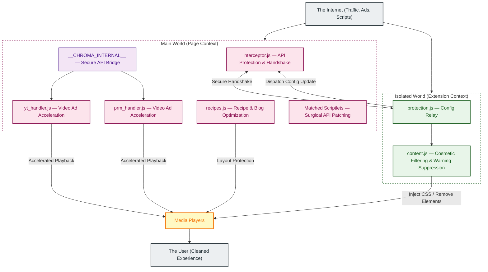
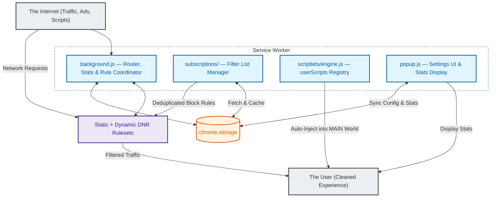

# Chroma Ad-Blocker

**Chroma Ad-Blocker** is a professional-grade, high-performance browser extension built for Manifest V3 (MV3). It employs a sophisticated multi-layered strategy to maintain functionality across a wide range of websites while maintaining a minimal resource footprint. Chroma is free, source-available, and privacy-focused. For optimal performance, it is recommended to disable other ad-blocking extensions while using Chroma.

## Key Features

- **YouTube Ad Stripping**: Chroma's primary defense against YouTube ads. It intercepts and cleans ad-related metadata from JSON payloads before they reach the player, providing a seamless, zero-latency viewing experience without the need for acceleration.
- **Dynamic Ad Acceleration**: Automatically identifies and accelerates video ads at a configurable speed (×4–×16, default ×8) on YouTube and Amazon Prime Video (Twitch uses server-side ad insertion and does not support ad acceleration), serving as a robust fallback when stripping is disabled.
- **Split-Tunnel Proxy Router**: Allows routing specific domains through a custom HTTP, HTTPS, or SOCKS5 proxy server directly in the browser while leaving all other traffic direct. Includes on-the-fly AES-256-GCM encryption for proxy credentials.
- **Multi-Part DNR Network Blocking**: Utilizes a 10-part static Declarative Net Request (DNR) ruleset supplemented by runtime dynamic rules, blocking trackers, invasive analytics, and traditional banner ads at the browser engine level.
- **Live Filter List Subscriptions**: Subscribes to external filter lists (Hagezi Pro Mini, Chroma Hotfix) that refresh automatically every 24 hours. Subscription rules are deduplicated against the static ruleset before allocation to maximize coverage within the dynamic rule budget.
- **Scriptlet Injection Engine**: A high-performance surgical layer powered by the `userScripts` API. It translates uBlock Origin/AdGuard syntax into native JavaScript and injects matched scriptlets at specific navigation milestones (`document_start`, `document_idle`, `document_end`) to neutralize anti-adblock scripts, prune dynamic JSON payloads, and intercept API calls.
- **Cosmetic Filtering Layer**: Removes ad slots, placeholders, and unwanted UI elements (Shorts, Merch, Offers) via high-speed CSS injection and DOM mutation monitoring.
- **Safety Exclusion Protocol**: Automatically excludes critical infrastructure, including financial institutions, authentication providers, and government domains (.gov) to ensure zero disruption to essential workflows.
- **Security-Hardened Architecture**: Features closure-scoped session state, validated config update pipelines, pristine API caching, and a dead man's switch to prevent host-page interference and script hijacking.
- **Recipe & Blog Optimization**: Provides specialized protection for high-clutter recipe and lifestyle sites. It prevents ad scripts from breaking site layouts, preserves recipe card content, and suppresses aggressive anti-adblock overlays and scroll-locks.
- **Platform Compatibility**: Fully compatible with **Windows**, **macOS**, and **Linux** versions of Google Chrome (and other Chromium-based browsers).

---

## Architecture Overview

Chroma utilizes a multi-layered execution model designed to survive the ephemeral lifecycle of Manifest V3 service workers while maintaining maximum performance and security.

**Diagram 1 — Page Execution Flow**

How Chroma operates inside the browser tab on every page load.

---

**Diagram 2 — Background & Network Flow**

How Chroma manages rules, storage, and network-level blocking from the service worker.

---

## System Layers

### Layer 1: Network-Level Blocking (rules/, background.js, subscriptions/)
The primary engine of Chroma, powered by the Declarative Net Request (DNR) API. Chroma partitions its blocking logic into a 10-part system of static rulesets covering over 299,000 domain-level block rules, augmented by dynamic rules for anti-detection exemptions and runtime filter list subscriptions. Subscription rules are automatically deduplicated against the static ruleset on each refresh, and scored by a priority budget allocator before being applied. The Service Worker coordinates these rulesets and collects blocking statistics.

### Layer 2: Scriptlet Injection (scriptlets/engine.js)
The advanced surgical layer of the extension, migrated to the high-performance `chrome.userScripts` API. This engine parses complex scriptlet rules from filter list subscriptions, including uBlock Origin and AdGuard aliases. Key capabilities include:
- **JSON Pruning**: Uses strict dot-notation path pruning (`json-prune`) to intercept and clean dynamic data payloads in `JSON.parse` calls.
- **Regex Translation**: Features a built-in pre-processor that translates uBO network-style patterns (e.g., `||example.com^`) into optimized JavaScript RegExp strings for runtime matching.
- **Flexible Execution Timing**: Supports explicit timing flags (`document_start`, `document_idle`, `document_end`), ensuring scriptlets execute at the optimal lifecycle moment (defaulting to `document_start` for critical API tampering).
- **Broad Compatibility**: Supports a wide range of scriptlets including `abort-on-property-read`, `set-constant`, `prevent-fetch`, and `no-eval-if`.

### Layer 3: YouTube Ad Stripping & Acceleration (yt_handler.js, prm_handler.js)
A specialized foundation layer designed specifically for YouTube and Prime Video. It utilizes a dual-mode strategy:
- **Primary (Stripping)**: Intercepts raw JSON responses from the YouTube API and surgically removes ad metadata (e.g., `adPlacements`, `playerAds`) before the player reads them. This results in an ad-free experience without pauses or acceleration.
- **Fallback (Acceleration)**: If stripping is disabled or bypassed, Chroma detects active ads and accelerates them at a configurable speed (×4–×16, default ×8) while synchronizing with a custom overlay to deliver a seamless transition.
Session state is fully private to the handler closure — host-page scripts cannot observe or tamper with internal state.

### Layer 4: Cosmetic & Warning Suppression (content.js)
Utilizes a high-performance MutationObserver and CSS injection via Constructable Stylesheets. This layer hides ad slots, removes unsolicited overlay dialogs that restrict content access based on browser configuration, and cleans up the UI by removing non-video components like Shorts, Merchandise, and Movie/TV offers.

### Layer 5: Universal Protection (protection.js, interceptor.js)
A proactive security layer that maintains extension integrity across execution contexts. `interceptor.js` runs in the Main World to shadow sensitive browser APIs and expose the secure `__CHROMA_INTERNAL__` bridge. `protection.js` reads stored configuration at page load, dispatches the `__EXT_INIT__` document event to signal the MAIN world handlers, and relays live config updates from the background to the MAIN world handlers via CustomEvent.

### Layer 6: Recipe & Blog Protection (recipes.js)
A specialized defense-in-depth layer optimized for high-clutter recipe and lifestyle blogs (e.g., CafeMedia/Raptive and Dotdash Meredith sites). It implements a multi-pronged strategy to ensure a clean reading experience:
- **Style Protection**: Prevents aggressive anti-adblock scripts from stripping `<style>` and `<link>` elements, ensuring the site's layout remains intact.
- **Recipe Content Preservation**: Uses semantic and container-based exclusion to ensure that ingredients and instructions are never accidentally hidden by cosmetic filters.
- **Anti-Adblock Containment**: Neutres known anti-adblock recovery payloads in script handlers and redirects, and suppresses intrusive alert/confirm dialogs.
- **Scroll Lock Recovery**: Dynamically detects and reverses scroll-locks (e.g., `overflow: hidden`) and body-hiding tactics used by ad-block walls.
- **Site-Specific Rules**: Includes custom cosmetic overrides for major platforms like AllRecipes, Food Network, NYT Cooking, and Serious Eats.

---

## Privacy & Transparency

Chroma processes everything locally — no data is ever sent to Chroma's servers because there are none. However, to maintain compatibility with certain websites, Chroma includes a small set of **Allow Rules** that permit specific, standard ad-measurement requests to reach their intended destinations. These rules are scoped exclusively to the supported streaming platform as the initiator domain.

Chroma does not intercept or store any data from these requests. For a full explanation of this tradeoff, see the [Privacy Policy](docs/PRIVACY_POLICY.md).

---

## Media Proxy Router (Split-Tunneling)

Chroma includes a built-in split-tunnel proxy router that allows you to route traffic for specific domains through a proxy server while keeping the rest of your browser traffic on your direct, local connection. This operates entirely within the browser via dynamic Proxy Auto-Configuration (PAC) scripts, meaning it does not require a system-level VPN installation.

### Supported Protocols
Chroma supports `HTTP`, `HTTPS`, and `SOCKS5` proxies. You can force a specific protocol by adding a prefix to the proxy host (e.g., `https://` or `socks5://`). If no prefix is provided, it defaults to standard HTTP.

### Security
Your proxy credentials (username and password) are encrypted locally using AES-256-GCM via the native Web Crypto API before being stored to disk. They are decrypted dynamically in-memory only when the proxy server challenges the browser for authentication, providing excellent obfuscation against disk-level inspection.

### Example: Setting up NordVPN
Many commercial VPN providers (like NordVPN, ExpressVPN, and PIA) operate browser-compatible proxy servers. Here is how to route specific domains through a NordVPN server (e.g., Albania #80):

1. **Host:** Enter `https://al80.nordvpn.com` *(Note the `https://` prefix, as NordVPN requires encrypted HTTPS proxies)*
2. **Port:** Enter `89` *(NordVPN's official HTTPS proxy port)*
3. **Username & Password:** You **cannot** use your standard NordAccount email/password. You must use your auto-generated **Service Credentials**, which can be found in your NordAccount dashboard under *Services > NordVPN > Manual Setup*.
4. **Domains:** Add the domains you want to route (e.g., `youtube.com`) to the active list.
5. Click **Accept Settings**.

### Smart-Link Auto-Expansion
To prevent "infinite spin" and geo-blocking issues caused by IP mismatches between a site's UI and its video delivery network, Chroma includes a **Smart-Link** system. When you add a major streaming service to your proxy list, Chroma automatically identifies and proxies its associated media delivery networks (CDNs).

For example, adding `youtube.com` automatically proxies `googlevideo.com` and `ytimg.com`, ensuring that the video stream itself originates from the same proxy IP as your main session. Supported services include:
- **YouTube** (`googlevideo.com`, `ytimg.com`, `ggpht.com`)
- **Netflix** (`nflxvideo.net`, `nflxext.com`, `nflxso.net`)
- **Amazon Prime Video** (`aiv-cdn.net`, `pv-cdn.net`, + all global TLDs like `.de`, `.co.jp`)
- **Disney+**, **Max (HBO)**, **Hulu**, **Spotify**, and **Twitch**.

---

## YouTube Ad Stripping (The "Stripper")

Chroma features a high-performance **YouTube Ad Stripper** that provides a superior alternative to traditional ad blocking and acceleration. 

### How it Works
Instead of reacting to ads after they appear, the Stripper operates at the data layer. It intercepts communication between your browser and YouTube's internal API (`/youtubei/v1/player`, `/next`, etc.) and surgically removes ad-related metadata before the YouTube player can process it.

- **Upstream Neutralization**: By deleting fields like `adPlacements`, `adSlots`, and `playerAds` from the raw JSON responses, the Stripper makes the YouTube player believe the video is entirely ad-free.
- **Zero-Latency Experience**: Because the ads are "stripped" before they ever load, there is no "Ad starting in 5 seconds" countdown, no black screens, and no need for the acceleration engine to kick in.
- **Payload Interception**: It utilizes deep hooks into `window.fetch`, `XMLHttpRequest`, and `JSON.parse` to ensure that even batched or worker-side requests are cleaned of ad data.
- **Feed & Search Optimization**: Beyond the video player, it strips promoted "Sparkles" ads, suggested products, and sponsored results from your home feed and search results.

> [!TIP]
> While "Ad Acceleration" is still available as a fallback, the **Stripper** is the recommended method for a seamless, "native" YouTube experience.

---

## Permissions

Chroma requests the following permissions. Each is required for a specific, documented purpose.

| Permission | Reason |
|---|---|
| `declarativeNetRequest` | Enables and manages the static and dynamic DNR rulesets that perform network-level ad and tracker blocking at the browser engine level. |
| `declarativeNetRequestFeedback` | Allows the service worker to read which rules fired, used to collect per-session blocking statistics displayed in the popup. |
| `storage` | Base API required to persist user configuration and subscription metadata across sessions. |
| `unlimitedStorage` | Chrome's default `chrome.storage.local` cap is 10 MB — insufficient for Chroma's runtime needs. Storage holds cached subscription rule sets (Hagezi Pro Mini alone can approach this limit), the static deduplication index, blocking statistics, and user configuration. No storage is used to collect or transmit user data. |
| `tabs` | Required to read the active tab's URL for whitelist matching in the popup and to reload the tab when the whitelist is toggled. |
| `alarms` | Powers the 24-hour subscription refresh cycle. Chrome MV3 service workers are ephemeral and cannot use `setInterval` — `chrome.alarms` is the only reliable timer mechanism available. |
| `userScripts` | The primary API for the scriptlet engine. Allows registered scriptlets to execute in the page's MAIN world context with optimal performance and native lifecycle management. |
| `scripting` | Used for supplemental on-demand script injection and legacy compatibility. |
| `webNavigation` | Provides navigation lifecycle events that trigger the scriptlet engine and MAIN world handler injection at the correct point in the page load sequence. |

---

## Security Hardening

Chroma implements several advanced security measures to ensure extension integrity and prevent bypass by third-party scripts:

- **Closure-Scoped Session State**: All session tracking variables in the acceleration handlers are private to the IIFE closure. Host-page scripts cannot read or modify acceleration state, session flags, or ad counters.
- **Config Update Validation**: All incoming configuration updates — whether from the popup or a `__CHROMA_CONFIG_UPDATE__` CustomEvent — are validated against a strict key allowlist with type and range checks. Invalid values are silently rejected before reaching the internal config object.
- **Immutable API Bridge**: Exposes internal utilities via a locked `__CHROMA_INTERNAL__` object. This bridge is protected using `Object.defineProperty` with `writable: false` and `configurable: false`, preventing host pages from hijacking extension logic.
- **Pristine API Caching**: `interceptor.js` captures and freezes native browser APIs (such as `querySelector`, `setTimeout`, and `Function.prototype.toString`) immediately at `document_start`. This ensures that even if a site attempts prototype pollution, the extension operates using trusted, original functions.
- **Dead Man's Switch**: If core native APIs fail integrity checks at startup, the interceptor severs its secure port and falls back to safe defaults rather than operating in a potentially compromised environment.
- **Sentinel Hardening**: Internal activation state is managed via a private `WeakMap` within the handler closure. This prevents host-page scripts from observing or tampering with the extension's lifecycle markers once initialization is complete.
- **Secure Config Handshake**: A secure, capture-phase handshake establishes a private communication pipeline (`MessageChannel`) between the Main World and the protected background. This allows for the delivery of verified configuration and selector sets via a randomized, per-session port transfer nonce, ensuring that sensitive data remains inaccessible to page scripts.
- **Origin Authentication**: The Background Service Worker strictly validates the origin and sender context of all incoming messages, rejecting sensitive data or configuration requests from outside the extension's verified context.

---

## Quick Start

1. Click **Download Current Version** or get the latest release from [GitHub](https://github.com/Dabrogost/Chroma-Ad-Blocker/releases/latest), and extract the ZIP file.
2. Open `chrome://extensions` in Chrome.
3. Toggle on **Developer Mode** in the top-right corner.
4. Click **Load unpacked** and select the `extension/` folder inside the extracted directory.
5. Done — Chroma is active on all tabs. Pin it from the extensions menu to access the popup.

## Configuration

| Setting | Description | Default |
|---------|-------------|---------|
| `enabled` | Global switch for all features. | `true` |
| `networkBlocking` | Enables DNR ruleset blocking. | `true` |
| `stripping` | Enables YouTube Ad Stripping (the primary blocker). | `true` |
| `acceleration` | Enables accelerated ad playback (as a fallback). | `true` |
| `accelerationSpeed` | Playback rate multiplier for accelerated ads (×4, ×8, ×12, or ×16). | `8` |
| `cosmetic` | Enables hiding ad placeholders via CSS. | `true` |
| `hideShorts` | Removes Shorts component modules. | `false` |
| `hideMerch` | Removes Merchandise panels. | `true` |
| `hideOffers` | Removes Movie/TV offer modules. | `true` |
| `suppressWarnings` | Removes unsolicited overlay dialogs that restrict content access. | `true` |
| `whitelist` | Toggles blocking for the current domain. | `false` |

---

## AI Usage & Quality Assurance Disclosure

Portions of this codebase, including initial logic structures and documentation, were developed with the assistance of agentic AI coding assistants. To ensure project integrity, every AI-assisted component has been manually audited, refactored, and verified to meet strict security and performance standards. This collaborative approach combines the efficiency of advanced tooling with focused oversight and robust test coverage.

---

## Filter List Credits

Chroma subscribes to the following third-party filter lists at runtime. These lists are not bundled with the extension — they are fetched and applied dynamically.

- **Hagezi Pro Mini** by [hagezi](https://github.com/hagezi/dns-blocklists) — [MIT License](https://github.com/hagezi/dns-blocklists/blob/main/LICENSE)
- **Chroma Hotfix** — Maintainer-controlled list for platform-specific overrides.

---

## Legal Disclaimers

**Trademark Disclaimer:** YouTube is a trademark of Google LLC. Amazon Prime Video is a trademark of Amazon.com, Inc. Chroma Ad-Blocker is an independent project and is NOT affiliated with, endorsed by, or sponsored by Google LLC, YouTube, Amazon.com, Inc., or any other third-party platform.

**Usage Warning:** Using ad-blockers or ad-acceleration tools may violate the Terms of Service of various platforms. By using Chroma, you acknowledge and assume all risks associated with potential account restrictions or enforcement actions.

---

## Security Policy

For information on how to report security vulnerabilities, please see our [Security Policy](docs/SECURITY.md).

---

## Support the Project

Chroma is a solo project dedicated to restoring the web to its fast, private, and uninterrupted roots. It is 100% free for everyone, forever. If this tool has made your daily browsing a little more colorful, consider supporting this mission.

  <a href="https://github.com/Dabrogost/Chroma-Ad-Blocker">GitHub Repository</a>
   
   
  

  Copyright 2026 Dabrogost

