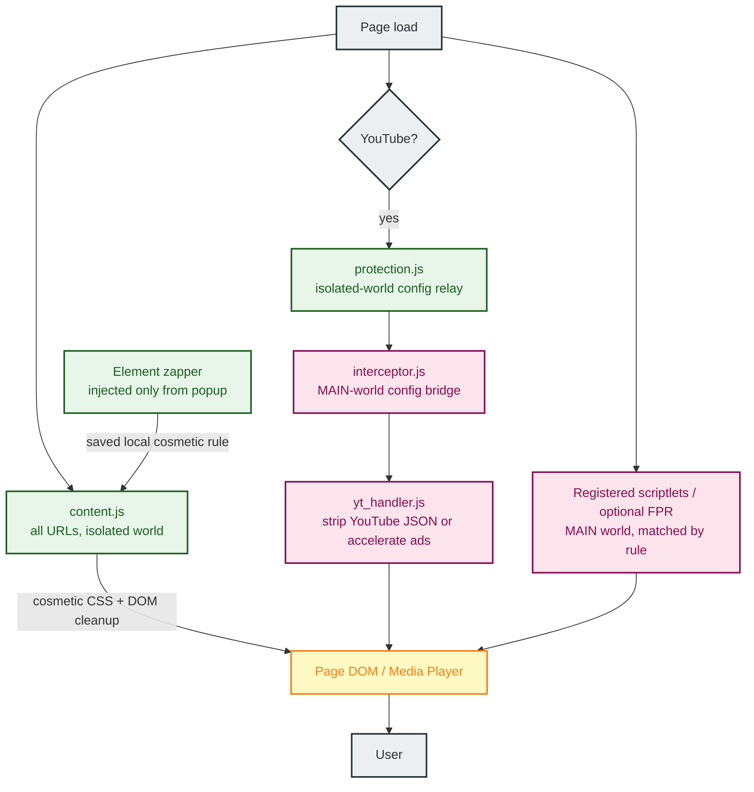

# Chroma Ad-Blocker

**Chroma Ad-Blocker** is a free, open-source Manifest V3 browser extension built for local, auditable ad blocking on Chrome and Chromium-based browsers. It combines browser-engine DNR blocking, YouTube payload stripping, scriptlets, cosmetic filtering, media-aware proxy routing, local statistics, and optional privacy hardening without Chroma-operated telemetry. Chroma processes browsing activity locally and, when Chrome exposes DNR match feedback, keeps a bounded local request log as documented in the [Privacy Policy](docs/PRIVACY_POLICY.md).

For best results, disable other ad-blocking extensions while using Chroma. Layering multiple blockers can cause overlapping rules, false positives, and broken pages.

  

## Documentation

- [Installation & Configuration](docs/INSTALL.md)
- [Feature Guide](docs/FEATURES.md)
- [YouTube Protection](docs/YOUTUBE.md)
- [Media Proxy Router](docs/MEDIA_PROXY_ROUTER.md)
- [Filter List Subscriptions](docs/FILTER_LISTS.md)
- [Advanced User Scriptlets](docs/ADVANCED_USER_SCRIPTLETS.md)
- [Statistics & Health](docs/STATISTICS.md)
- [Permissions](docs/PERMISSIONS.md)
- [Privacy Policy](docs/PRIVACY_POLICY.md)
- [Performance Guide](docs/PERFORMANCE.md)
- [Project Philosophy](docs/PROJECT_PHILOSOPHY.md)
- [Terms of Service](docs/ToS.md)

## Key Features

- **[YouTube Ad Stripping](docs/YOUTUBE.md)**: Removes ad-related metadata from YouTube JSON payloads before the player reads them, including sponsored Shorts overlay payloads.
- **[Split-Tunnel Proxy Router](docs/MEDIA_PROXY_ROUTER.md)**: Routes selected media domains through HTTP, HTTPS, SOCKS4, or SOCKS5 proxies while keeping unrelated browser traffic direct. Includes Global Fallback, Smart-Link media/CDN expansion, connection verification, WebRTC leak protection, and local-only proxy credential handling.
- **[Source-Generated DNR Network Blocking](docs/FEATURES.md#source-generated-dnr-network-blocking)**: Uses OISD Small and Big first, then fills otherwise-unused static capacity with a stable selection of adult and shock-site domains from OISD NSFW. Protected custom and recipe rules bring the packaged corpus to exactly 300,000 static rules.
- **[Live Filter List Subscriptions](docs/FILTER_LISTS.md)**: Supports Hagezi Pro Mini, EasyList, Fanboy Annoyance, the bundled Chroma Scriptlet Library, and user-added custom lists with local parsing and rule-budget allocation.
- **[Scriptlet Injection Engine](docs/FEATURES.md#scriptlet-injection-engine)**: Translates supported uBlock Origin and AdGuard-style scriptlets into native JavaScript, and lets advanced users add [trusted uBO-style scriptlet resources](docs/ADVANCED_USER_SCRIPTLETS.md) through Chrome's `userScripts` API.
- **[Quiet Console](docs/FEATURES.md#quiet-console)**: Optional DevTools noise reduction for handled scriptlet/fingerprint warnings and known ad/tracker request paths.
- **[Cosmetic Filtering & Element Zapper](docs/FEATURES.md#element-zapper)**: Removes ad slots, placeholders, unwanted UI, warnings, and user-selected page elements through CSS injection, DOM monitoring, and local cosmetic rules.
- **[Privacy Hardening & Fingerprint Randomization](docs/FEATURES.md#privacy-hardening-fingerprint-randomization)**: Optional controls for third-party cookies, Privacy Sandbox ad APIs, geolocation access, WebRTC routing behavior, and per-document fingerprint farbling.
- **[Local Event Tracker](docs/STATISTICS.md)**: A local-only Protection Intelligence dashboard for network, cleanup, scriptlet, proxy, and payload-cleanup events, plus a separate bounded DNR request log when Chrome exposes match feedback.
- **[Local-First Privacy](docs/PRIVACY_POLICY.md)**: Keeps settings, diagnostics, subscriptions, proxy configuration, and protection statistics on the user's device without Chroma telemetry.

## Quick Start

1. Get the latest release from [GitHub Releases](https://github.com/Dabrogost/Chroma-Ad-Blocker/releases/latest), and extract the ZIP file.
2. Open `chrome://extensions` in Chrome.
3. Toggle on **Developer Mode** in the top-right corner.
4. Click **Load unpacked** and select the extracted folder that contains `manifest.json`.
5. Enable User Scripts support:
   - **Chrome 138+**: On the Chroma extension card, click **Details**, then enable **Allow User Scripts**.
   - **Chrome 122-137**: The **Developer Mode** toggle from step 3 enables the `userScripts` API.
6. Done. Network rules become active immediately. Reload tabs that were already open so Chroma's page-side cosmetic, scriptlet, and platform handlers can initialize. Browser-restricted pages remain outside extension access. Pin Chroma from the extensions menu to access the popup.

When a newer GitHub release is available, Chroma can guide unpacked-extension updates from **Settings -> Updates** if the release includes the exact direct ZIP asset and signed `updates.json`. Chroma fetches those release assets internally, so users do not manually download `updates.json` and the extension does not need Chrome's download permission or download dialog. It verifies the update signature and package hash, builds a dry-run install plan, probes folder write access, backs up changed files, writes `manifest.json` last, and then shows a **Reload Chroma** action to load the updated files.

For the expanded install and update flow, troubleshooting table, configuration reference, and Health panel notes, see [Installation & Configuration](docs/INSTALL.md).

## Architecture At A Glance

Chroma is built around a layered MV3 model. Browser-engine DNR rules handle request blocking without waking extension JavaScript for every request. Content scripts handle cosmetic cleanup in the isolated world. MAIN-world handlers are used only where needed for platform-specific interception, scriptlets, optional fingerprint randomization, and media handling.

```mermaid
graph TD
    classDef ext fill:#e8f5e9,color:#1b5e20,stroke:#1b5e20,stroke-width:2px
    classDef main fill:#fce4ec,color:#880e4f,stroke:#880e4f,stroke-width:2px
    classDef page fill:#fff9c4,color:#f57f17,stroke:#f57f17,stroke-width:2px
    classDef actor fill:#eceff1,color:#263238,stroke:#263238,stroke-width:2px

    LOAD["Page load"]:::actor
    PAGE["Page DOM / Media Player"]:::page
    USER["User"]:::actor

    LOAD --> CONTENT["content.js<br/>all URLs, isolated world"]:::ext
    CONTENT -->|"cosmetic CSS + DOM cleanup"| PAGE

    LOAD --> MEDIA{"YouTube?"}:::actor
    MEDIA -->|"yes"| PROTECTION["protection.js<br/>isolated-world config relay"]:::ext
    PROTECTION --> BRIDGE["interceptor.js<br/>MAIN-world config bridge"]:::main
    BRIDGE --> HANDLERS["yt_handler.js<br/>strip YouTube JSON or accelerate ads"]:::main
    HANDLERS --> PAGE

    LOAD --> SCRIPTLETS["Registered scriptlets / optional FPR<br/>MAIN world, matched by rule"]:::main
    SCRIPTLETS --> PAGE

    ZAP["Element zapper<br/>injected only from popup"]:::ext -->|"saved local cosmetic rule"| CONTENT

    PAGE --> USER
```

The Amazon Prime Video accelerator is temporarily disabled. Its implementation remains in the source tree for future rehabilitation, but it and its supporting media bridge are not registered on Amazon or Prime Video pages.

For user-facing behavior and lower-overhead configuration choices, see the [Feature Guide](docs/FEATURES.md) and [Performance Guide](docs/PERFORMANCE.md).

## Privacy & Transparency

Chroma processes core extension state locally. It does not operate telemetry, analytics, or tracking servers. Settings, whitelists, cached subscription rules, proxy settings, local statistics, request logs, and diagnostics remain in `chrome.storage.local`.

Some optional or normal features make external requests: remote filter-list updates, GitHub release checks, proxy connectivity tests, and user-configured proxy routes. These are documented in the [Privacy Policy](docs/PRIVACY_POLICY.md).

Chroma can apply allow rules from bundled compatibility rules, enabled subscriptions, and user whitelists. Chroma does not read response bodies merely because a request is allowed, but Chrome can expose the matched request URL and rule metadata to Chroma's bounded local DNR request log. Chroma does not transmit that log to a Chroma service.

For another account-level privacy improvement, open [Google My Ad Center](https://myadcenter.google.com) and turn **Personalized Ads** to **OFF**.

## Trust Model

Chroma is distributed through GitHub releases instead of the Chrome Web Store. That means installation requires a higher level of user trust, but it also keeps the release package source-auditable, enables a guided updater for exact release ZIP assets, and avoids store-mediated update delays for platform-specific fixes.

Review these before installing:

- [Permissions](docs/PERMISSIONS.md)
- [Privacy Policy](docs/PRIVACY_POLICY.md)
- [Project Philosophy](docs/PROJECT_PHILOSOPHY.md#why-not-the-chrome-web-store)

## Companion Extensions & Alternatives

Chroma already includes network blocking, cosmetic filtering, scriptlets, proxy routing, and platform-specific handling, so another ad blocker is not recommended by default. Extensions that do something different can still pair well with it, such as [SponsorBlock](https://chromewebstore.google.com/detail/sponsorblock-for-youtube-s/mnjggcdmjocbbbhaepdhchncahnbgone) for skipping sponsor segments on YouTube.

If you prefer a store-installed extension, a Firefox-first setup, or a dedicated proxy manager, see [Recommended Alternatives](docs/PROJECT_PHILOSOPHY.md#recommended-alternatives).

## Support The Project

Chroma is a solo project dedicated to restoring the web to its fast, private, and uninterrupted roots. It is 100% free for everyone, forever. If this tool has made your daily browsing a little more colorful, consider supporting the mission.

  

## Credits, License, And Disclaimers

Chroma uses logic and patterns derived from Brave Browser's YouTube ad-stripping scriptlets and data from third-party filter lists including Hagezi Pro Mini, OISD Small/Big/NSFW, EasyList, and Fanboy Annoyance. See [Filter List Subscriptions](docs/FILTER_LISTS.md#third-party-credits) for details.

Portions of this codebase, including initial logic structures and documentation, were developed with assistance from agentic AI coding assistants. AI-assisted changes are reviewed and tested before release under the same project process as other contributions; this is a development practice, not an independent security certification.

YouTube, Google, Chrome, Amazon, Amazon Prime Video, Twitch, Netflix, Spotify, Disney+, Hulu, Max, HBO, NordVPN, ExpressVPN, PIA, Brave, and other names are trademarks of their respective owners. Chroma Ad-Blocker is an independent project and is not affiliated with, endorsed by, or sponsored by those entities.

Using ad blockers, ad stripping, proxy routing, or ad-acceleration tools may conflict with the terms of service of various platforms. Review the rules of services you use and understand the possible account or access consequences.

  Copyright 2026 Dabrogost — Chroma-authored material: GPL-3.0-or-later; third-party material retains the licenses identified in the source and credits.

