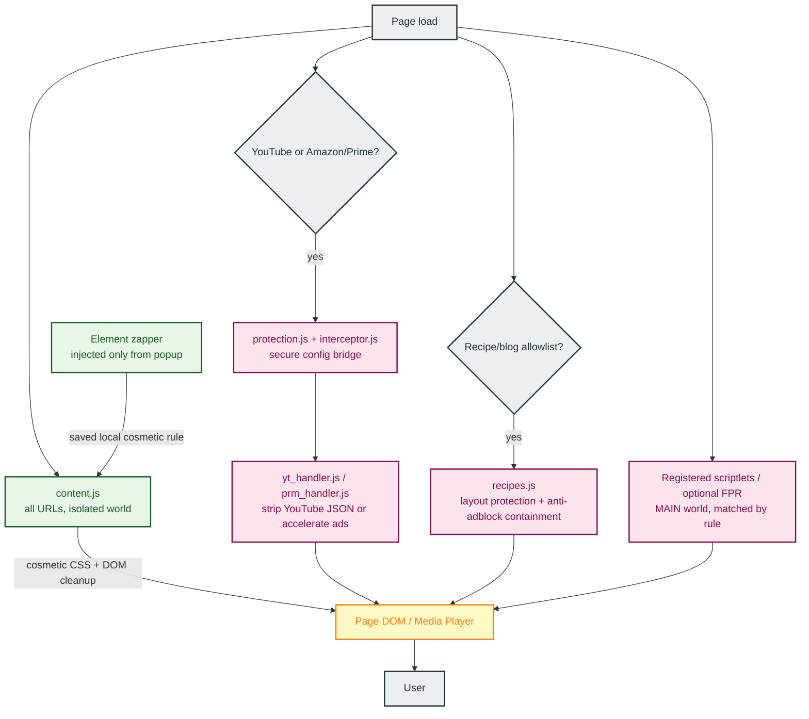

# Architecture Deep Dive

Chroma uses a multi-layered execution model designed to survive the ephemeral lifecycle of Manifest V3 service workers while preserving clear performance, privacy, and security boundaries.

The short version:

- **Declarative Net Request (DNR)** is the browser-engine policy gate for request blocking, redirects, allow rules, and dynamic rules.
- **The service worker** manages rules, storage, subscriptions, proxy routing, health state, and UI requests.
- **Isolated-world content scripts** handle cosmetic cleanup, warning suppression, local zapper rules, and extension-to-page coordination.
- **MAIN-world scripts** run only when needed for platform-specific interception, scriptlets, optional fingerprint randomization, and media handlers.
- **Proxy Auto-Configuration (PAC)** is the transport selector for user-configured browser-level proxy routing.

## Page Execution Flow

How Chroma operates inside a browser tab. The always-on isolated content script handles cosmetics; MAIN-world logic only runs where the manifest or registered scriptlets match.

## Background & Network Flow

How Chroma manages rules, storage, and network-level blocking from the service worker.

## System Layers

### Layer 1: Network-Level Blocking (extension/rules/, extension/background/dnrState.js, extension/subscriptions/)

The primary engine of Chroma is powered by the Declarative Net Request API. Chroma partitions its blocking logic into source-owned static rulesets: generated OISD Big rules, a protected custom static layer, and a specialized recipe layer.

#### How Chroma Keeps Large Static Rulesets Practical

Users often wonder how static rules can operate without moving every request through extension JavaScript. Chroma relies on four architectural advantages:

- **Engine-Level Matching**: Unlike legacy ad blockers that use the `webRequest` API for request decisions, DNR rules are handed off to Chromium's Declarative Net Request implementation before matching.
- **Browser-Managed Indexing**: Chromium validates and indexes static rulesets when the extension is installed or updated. Chroma does not depend on a specific internal data structure or lookup guarantee.
- **Low JS Request-Path Overhead**: Because the matching logic lives outside of the extension's execution context, Chroma avoids waking its own service worker for every blocked request.
- **Deduplication Budgeting**: Subscription rules from Hagezi Pro Mini are automatically deduplicated against the static ruleset on each refresh. This reserves the dynamic rule budget for unique, high-priority threats.

### Layer 1b: URL Cleanup & De-AMP (defaultDynamicRules.js, content.js)

Chroma can clean common tracking URLs without routing requests through extension JavaScript. **Tracking URL Cleanup** uses dynamic DNR redirect rules to remove known attribution parameters such as `utm_*`, `fbclid`, `gclid`, and similar campaign IDs from top-level navigations. The cleanup rule set is split into small Chrome-compatible matchers so it stays within DNR regex limits while each matched rule still removes the full known tracking-parameter set.

**De-AMP Links** is optional and disabled by default. When enabled, Chroma redirects supported Google AMP viewer and AMP cache URLs to the publisher URL, while respecting current-site and target-domain whitelists.

### Layer 2: Scriptlet Injection (scriptlets/engine.js)

The advanced surgical layer of the extension is powered by the high-performance `chrome.userScripts` API. This engine registers supported scriptlet rules from filter list subscriptions and explicit user-added scriptlet resources. Subscription scriptlet rules can only call implementations shipped in Chroma's bundled library; user-added resources live in a separate advanced settings lane and run only after the user adds both a resource URL and matching rules.

Key capabilities include:

- **JSON Pruning**: Uses strict dot-notation path pruning (`json-prune`) to intercept and clean dynamic data payloads in `JSON.parse` calls.
- **Regex Translation**: Includes a pre-processor that translates uBO network-style patterns, such as `||example.com^`, into optimized JavaScript RegExp strings for runtime matching.
- **Flexible Execution Timing**: Supports explicit timing flags (`document_start`, `document_idle`, `document_end`) so scriptlets execute at the right lifecycle moment. Critical API tampering defaults to `document_start`.
- **Broad Compatibility**: Supports scriptlets including `abort-on-property-read`, `set-constant`, `prevent-fetch`, and `no-eval-if`.

### Layer 3: Cosmetic & Warning Suppression (content.js)

Chroma uses a high-performance MutationObserver and CSS injection via Constructable Stylesheets. This layer hides ad slots, removes unsolicited overlay dialogs that restrict content access based on browser configuration, and cleans up UI elements such as Shorts, Merchandise, and Movie/TV offers.

### Layer 3b: Element Zapper (content/zapper.js, background/handlers.js)

The Element Zapper is an on-demand cosmetic rule builder for elements that are too site-specific or personal to belong in a shared filter list. From the popup, click **Zap Element**, choose the page element, and Chroma generates a scoped selector preview before saving it as a local rule. Saved zapper rules are stored locally, applied by the cosmetic layer, and can be enabled, disabled, or removed from settings.

### Layer 4: Universal Protection (protection.js, interceptor.js)

This proactive security layer maintains extension integrity across execution contexts. `interceptor.js` runs in the MAIN world to shadow sensitive browser APIs and expose the secure `__CHROMA_INTERNAL__` bridge. `protection.js` reads stored configuration at page load, dispatches the `__EXT_INIT__` document event to signal MAIN-world handlers, and relays live config updates from the background to MAIN-world handlers via `CustomEvent`.

### Layer 5: YouTube Ad Stripping (yt_handler.js)

This specialized platform layer intercepts raw JSON responses from the YouTube API and surgically removes ad metadata, such as `adPlacements` and `playerAds`, before the player reads them. The goal is a seamless ad-free experience without countdowns, black screens, pauses, or playback acceleration. Session state is fully private to the handler closure, so host-page scripts cannot observe or tamper with internal state.

### Layer 6: Recipe & Blog Protection (recipes.js)

This defense-in-depth layer is optimized for high-clutter recipe and lifestyle blogs, including CafeMedia/Raptive and Dotdash Meredith sites.

It implements:

- **Style Protection**: Prevents aggressive anti-adblock scripts from stripping `<style>` and `<link>` elements, preserving the site's layout.
- **Recipe Content Preservation**: Uses semantic and container-based exclusion so ingredients and instructions are not accidentally hidden by cosmetic filters.
- **Anti-Adblock Containment**: Neutralizes known anti-adblock recovery payloads in script handlers and redirects, and suppresses intrusive alert/confirm dialogs.
- **Scroll Lock Recovery**: Dynamically detects and reverses scroll locks such as `overflow: hidden` and body-hiding tactics used by ad-block walls.
- **Site-Specific Rules**: Includes cosmetic overrides for major platforms like AllRecipes, Food Network, NYT Cooking, and Serious Eats.

### Layer 7: Dynamic Ad Acceleration (prm_handler.js, yt_handler.js)

Dynamic Ad Acceleration is a fallback and specialized layer for Amazon Prime Video and YouTube when stripping is disabled. It ships off by default, detects active ads, and accelerates them at a configurable speed (`x4`, `x8`, `x12`, or `x16`, default `x8`) while synchronizing with a custom overlay to deliver a smoother transition.

Twitch uses server-side ad insertion and does not support this acceleration path.

### Layer 8: Browser Privacy & Fingerprint Hardening (browserPrivacy.js, fingerprintRandomization.js)

Chrome Privacy Hardening is optional and off by default. When enabled, Chroma uses Chrome's `privacy` API to block third-party cookies, keep Do Not Track disabled, and disable supported Privacy Sandbox ad APIs including Topics, Protected Audience, and ad measurement.

Geolocation Protection is also optional and off by default. When enabled, Chroma uses Chrome's `contentSettings.location` API to block sites from accessing your real physical location. It does not spoof or synthesize fake coordinates. Turning it off clears Chroma's rule so Chrome returns to the user's normal location setting.

Fingerprint Randomization is optional and off by default because some sites can be sensitive to fingerprint changes. When enabled, Chroma registers a MAIN-world script that randomizes or farbles supported fingerprint surfaces per document with a fresh non-persisted salt, including canvas, audio, WebGL, navigator hardware fields, and normalized language APIs. The full hostname is included only as domain separation, so two sites cannot share the same salt-derived surface by accident.

## Design Principles

Chroma is not trying to recreate MV2 request interception in MV3. It leans into the browser primitives MV3 still gives extensions:

- Use DNR for request decisions the browser can enforce efficiently.
- Do expensive parsing and subscription work at refresh time, not per request.
- Keep sensitive state local and scoped to extension storage or closure-private handler state.
- Use MAIN-world logic only where browser APIs or platform payload interception require it.
- Keep proxy routing separate from network blocking: DNR decides policy, PAC chooses transport.
- Make diagnostics transparent without turning local debug data into telemetry.

---

Next: [Media Proxy Router](MEDIA_PROXY_ROUTER.md)
