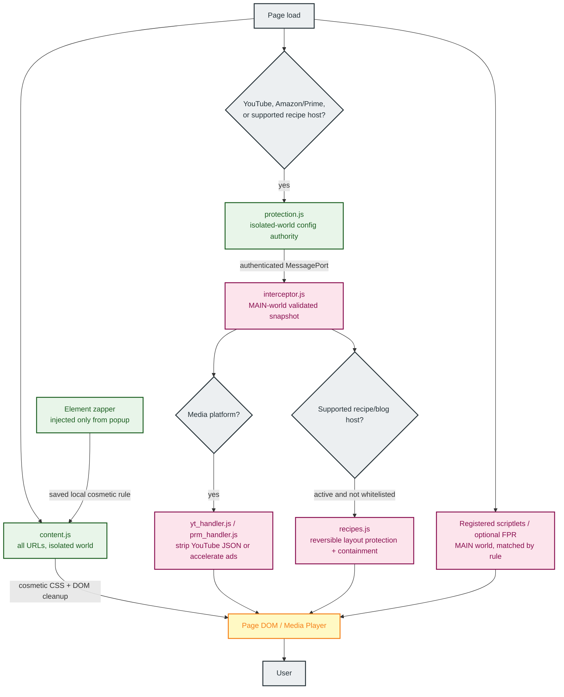
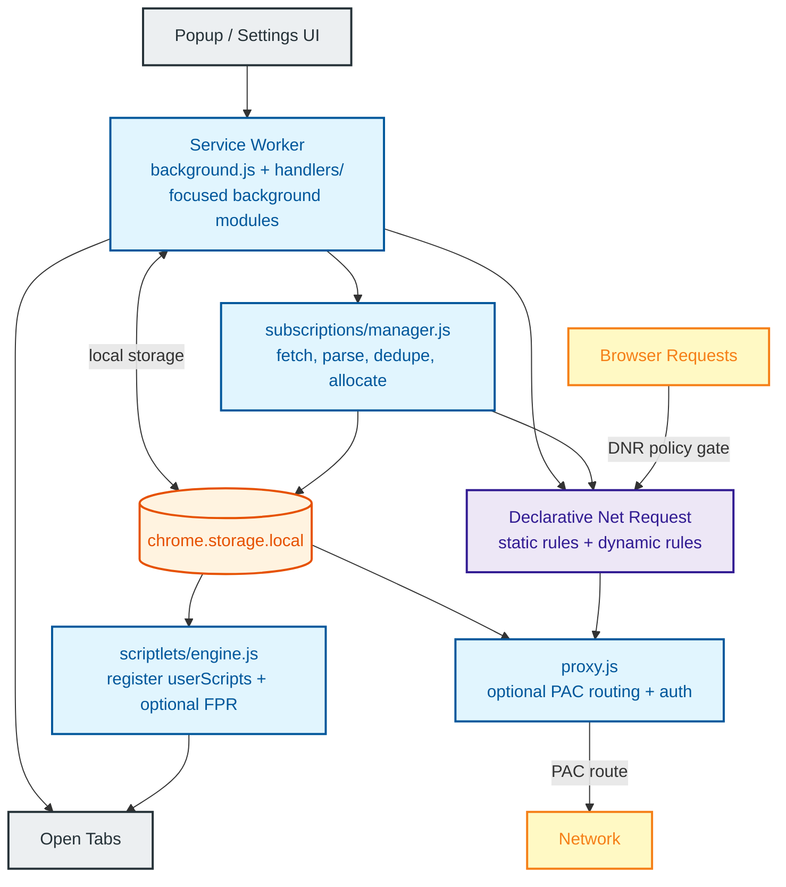

# Architecture Deep Dive

Chroma uses a multi-layered execution model designed to survive the ephemeral lifecycle of Manifest V3 service workers while preserving clear performance, privacy, and security boundaries.

The short version:

- **Declarative Net Request (DNR)** is the browser-engine policy gate for request blocking, redirects, allow rules, and dynamic rules.
- **The service worker** manages rules, storage, subscriptions, proxy routing, health state, and UI requests.
- **Isolated-world content scripts** handle cosmetic cleanup, warning suppression, local zapper rules, and extension-to-page coordination.
- **MAIN-world scripts** run only when needed for platform-specific interception, scriptlets, optional fingerprint randomization, and media handlers.
- **Proxy Auto-Configuration (PAC)** is the transport selector for user-configured browser-level proxy routing.

## Page Execution Flow

How Chroma operates inside a browser tab. The always-on isolated content script handles cosmetics; MAIN-world logic only runs where the manifest or registered scriptlets match.

## Background & Network Flow

How Chroma manages rules, storage, and network-level blocking from the service worker.

### Service-Worker Lifecycle Boundaries

The worker does not perform the same initialization on every event:

- **Every new worker instance / ordinary MV3 wake** evaluates the background module, registers event and message listeners, initializes request-log classification, restores proxy routing, reconciles DNR and cached subscription runtime state, checks the persisted `userScripts` registry, and reconciles browser privacy controls. This path does not fire `runtime.onStartup`.
- **`runtime.onInstalled`** runs for an install or extension update. A fresh install writes defaults; both install and update then initialize subscriptions and their alarm, reconcile browser controls and DNR, refresh stale lists, initialize scriptlets, and send current configuration to reachable open tabs.
- **`runtime.onStartup`** runs when the browser profile starts, not whenever an evicted worker is recreated. It reconciles browser controls, DNR, cached subscription state, and scriptlets; clears the bounded request log; ensures the subscription alarm exists; and sends configuration to reachable open tabs.
- **The subscription alarm** refreshes lists whose configured interval has elapsed. It does not repeat the complete install or browser-start sequence.
- **An ordinary message or extension event** runs its registered handler. If Chrome had to create a new worker first, the module-evaluation recovery work above also runs; if the worker was already alive, only the event-specific work is added.

## System Layers

### Layer 1: Network-Level Blocking (extension/rules/, extension/background/dnrState.js, extension/subscriptions/)

The primary engine of Chroma is powered by the Declarative Net Request API. Chroma partitions its blocking logic into source-owned static rulesets: OISD Small and Big are selected first, a stable cross-list selection of adult and shock-site domains from OISD NSFW fills any remaining capacity, and protected custom and recipe layers complete the 300,000-rule static corpus.

#### How Chroma Keeps Large Static Rulesets Practical

Users often wonder how static rules can operate without moving every request through extension JavaScript. Chroma relies on four architectural advantages:

- **Engine-Level Matching**: Unlike legacy ad blockers that use the `webRequest` API for request decisions, DNR rules are handed off to Chromium's Declarative Net Request implementation before matching.
- **Browser-Managed Indexing**: Chromium validates and indexes static rulesets when the extension is installed or updated. Chroma does not depend on a specific internal data structure or lookup guarantee.
- **Enforcement Outside JavaScript**: DNR matching and enforcement do not require Chroma's service worker. In unpacked profiles where Chrome exposes `onRuleMatchedDebug`, a separate matched-rule feedback event may still wake the worker to update local statistics and the request log.
- **Deduplication Budgeting**: Subscription rules from Hagezi Pro Mini are automatically deduplicated against the static ruleset on each refresh. This reserves the dynamic rule budget for unique, high-priority threats.

All dynamic network application flows through one serialized, generation-checked reconciliation coordinator. The coordinator derives desired state from the master and Network Blocking settings, rechecks that state immediately before committing to Chrome, and lets the newest requested state win over older refresh work. Turning protection back on, worker recovery, and `304 Not Modified` refreshes rebuild active subscription DNR from cached per-list rules rather than depending on a new download.

### Layer 1b: URL Cleanup & De-AMP (defaultDynamicRules.js, content.js)

Chroma can clean common tracking URLs without routing requests through extension JavaScript. **Tracking URL Cleanup** uses dynamic DNR redirect rules to remove known attribution parameters such as `utm_*`, `fbclid`, `gclid`, and similar campaign IDs from top-level navigations. The cleanup rule set is split into small Chrome-compatible matchers so it stays within DNR regex limits while each matched rule still removes the full known tracking-parameter set.

**De-AMP Links** is optional and disabled by default. When enabled, Chroma redirects supported Google AMP viewer and AMP cache URLs to the publisher URL, while respecting current-site and target-domain whitelists.

### Layer 2: Scriptlet Injection (scriptlets/engine.js)

The advanced surgical layer of the extension is powered by the high-performance `chrome.userScripts` API. This engine registers supported scriptlet rules from filter list subscriptions and explicit user-added scriptlet resources. Subscription scriptlet rules can only call implementations shipped in Chroma's bundled library; user-added resources live in a separate advanced settings lane and run only after the user adds both a resource URL and matching rules.

Both sources are synchronized as desired runtime state. Master protection off unregisters all Chroma-managed subscription and advanced `userScripts` while retaining stored rules and resources. Storage changes while off update caches only. Re-enable and worker recovery reconstruct the expected registry, and active whitelist domains become `excludeMatches`. Synchronization is serialized and generation-checked so rapid changes cannot leave stale or duplicate registrations.

Key capabilities include:

- **JSON Pruning**: Uses strict dot-notation path pruning (`json-prune`) to intercept and clean dynamic data payloads in `JSON.parse` calls.
- **Regex Translation**: Includes a pre-processor that translates uBO network-style patterns, such as `||example.com^`, into optimized JavaScript RegExp strings for runtime matching.
- **Flexible Execution Timing**: Supports explicit timing flags (`document_start`, `document_idle`, `document_end`) so scriptlets execute at the right lifecycle moment. Critical API tampering defaults to `document_start`.
- **Broad Compatibility**: Supports scriptlets including `abort-on-property-read`, `set-constant`, `prevent-fetch`, and `no-eval-if`.

### Layer 3: Cosmetic & Warning Suppression (content.js)

Chroma uses a high-performance MutationObserver and CSS injection via Constructable Stylesheets. This layer hides ad slots, removes unsolicited overlay dialogs that restrict content access based on browser configuration, and cleans up UI elements such as Shorts, Merchandise, and Movie/TV offers.

### Layer 3b: Element Zapper (content/zapper.js, background/handlers/zapperHandlers.js)

The Element Zapper is an on-demand cosmetic rule builder for elements that are too site-specific or personal to belong in a shared filter list. From the popup, click **Zap Element**, choose the page element, and Chroma generates a scoped selector preview before saving it as a local rule. Saved zapper rules are stored locally, applied by the cosmetic layer, and can be enabled, disabled, or removed from settings.

### Layer 4: Universal Protection (protection.js, interceptor.js)

This proactive security layer maintains extension integrity across execution contexts. `protection.js` runs in the isolated world, reads stored configuration and the whitelist, derives an effective fail-closed configuration, and authenticates a one-time handoff to MAIN-world `interceptor.js`. The challenge events, randomized transfer listener, and rejected candidate ports are short-lived. The accepted private `MessagePort` remains open so configuration and whitelist changes can reach an already-open page.

`interceptor.js` validates supported keys into closure-owned state and exposes a fresh frozen snapshot with a monotonic revision through `window.__CHROMA_INTERNAL__`. Because that object exists in the MAIN world, page scripts can directly read the exposed configuration, revision, and API surface. Freezing the snapshot and reserving the property protect its integrity; they do not make its values secret from the page.

Public bridge events are notification-only: handlers re-read the validated snapshot, and a page-dispatched notification cannot change configuration or advance its revision. Before authenticated state arrives, or when native-integrity checks fail, MAIN handlers remain inert.

### Layer 5: YouTube Ad Stripping (yt_handler.js)

This specialized platform layer intercepts raw JSON responses from the YouTube API and surgically removes ad metadata, such as `adPlacements` and `playerAds`, before the player reads them. Stripping operates independently of acceleration: it can be used alone, or acceleration can remain enabled as a fallback for an ad that survives payload cleanup. Session state is closure-owned, so host-page scripts cannot directly write it; pages can observe visible player behavior and can read the exposed bridge configuration.

### Layer 6: Recipe & Blog Protection (recipes.js)

This defense-in-depth layer is optimized for high-clutter recipe and lifestyle blogs, including CafeMedia/Raptive and Dotdash Meredith sites.

It implements:

- **Style Protection**: Prevents aggressive anti-adblock scripts from stripping `<style>` and `<link>` elements, preserving the site's layout.
- **Recipe Content Preservation**: Uses semantic and container-based exclusion so ingredients and instructions are not accidentally hidden by cosmetic filters.
- **Anti-Adblock Containment**: Neutralizes known anti-adblock recovery payloads in script handlers and redirects, and suppresses intrusive alert/confirm dialogs.
- **Scroll Lock Recovery**: Dynamically detects and reverses scroll locks such as `overflow: hidden` and body-hiding tactics used by ad-block walls.
- **Site-Specific Rules**: Includes cosmetic overrides for major platforms like AllRecipes, Food Network, NYT Cooking, and Serious Eats.

Recipe behavior loads inert and activates only after the trusted bridge reports master protection active and the current site not whitelisted. A disable or whitelist change in an already-open tab disconnects observers, cancels scheduled sweeps, removes Chroma-owned styles, restores Chroma-hidden inline styles when still unchanged, and deactivates API patches. API properties are restored only while Chroma's wrapper still owns the slot, so later page-owned replacements are preserved. Re-enabling does not accumulate wrappers, observers, or stylesheets.

### Layer 7: Dynamic Ad Acceleration (prm_handler.js, yt_handler.js)

Dynamic Ad Acceleration is an optional fallback and specialized layer for Amazon Prime Video and YouTube. It ships off by default, detects active ads, and accelerates them at a configurable speed (`x4`, `x8`, `x12`, or `x16`, default `x8`) while synchronizing with a custom overlay to deliver a smoother transition. On YouTube it may run alongside stripping and handle ads that still reach playback; it is not conditional on stripping being disabled. Prime Video uses the acceleration path without YouTube JSON stripping.

Twitch uses server-side ad insertion and does not support this acceleration path.

### Layer 8: Browser Privacy & Fingerprint Hardening (browserPrivacy.js, fingerprintRandomization.js)

Chrome Privacy Hardening is optional and off by default. When it and master protection are enabled, Chroma uses Chrome's `privacy` API to block third-party cookies, keep Do Not Track disabled, and disable supported Privacy Sandbox ad APIs including Topics, Protected Audience, and ad measurement.

Geolocation Protection is also optional and off by default. When it and master protection are enabled, Chroma uses Chrome's `contentSettings.location` API to block sites from accessing your real physical location. It does not spoof or synthesize fake coordinates.

Master off clears Chroma-owned browser privacy, geolocation, and WebRTC settings without erasing their requested feature values; master on restores them. Health keeps requested, controlled, and effective state separate. When another extension or browser policy owns a Chrome setting, Chroma reports degraded state instead of claiming success and automatically reconciles after control is released.

Fingerprint Randomization is optional and off by default because some sites can be sensitive to fingerprint changes. It requires both its feature toggle and master protection. When active, Chroma registers a MAIN-world script that randomizes or farbles supported fingerprint surfaces per document with a fresh non-persisted salt, including canvas, audio, WebGL, navigator hardware fields, and normalized language APIs. Master off unregisters it for future documents while preserving the requested toggle; existing documents may require reload because already-executed page code cannot always be reversed. The global whitelist and FPR-only whitelist both exclude matching sites.

## Design Principles

Chroma is not trying to recreate MV2 request interception in MV3. It leans into the browser primitives MV3 still gives extensions:

- Use DNR for request decisions the browser can enforce efficiently.
- Do expensive parsing and subscription work at refresh time, not per request.
- Keep authoritative mutable state local and scoped to extension storage or closure-private handler state; treat the frozen MAIN-world configuration snapshot as page-readable.
- Use MAIN-world logic only where browser APIs or platform payload interception require it.
- Keep proxy routing separate from network blocking: DNR decides policy, PAC chooses transport.
- Make diagnostics transparent without turning local debug data into telemetry.

## Failure Modes & Graceful Degradation

Chroma assumes that extension APIs, browser feedback paths, network refreshes, and page handshakes can fail. The goal is to keep independent layers working where possible, report degraded state in Health, and avoid turning a partial failure into broad breakage.

| Failure mode | Expected behavior | User-visible recovery |
|---|---|---|
| Service worker sleeps or is recreated | Browser-managed DNR rules continue to apply while the worker is asleep. A newly evaluated worker registers handlers and reconciles DNR, cached subscription/scriptlet runtime state, proxy state, and browser privacy controls. Alarm repair, request-log clearing, and open-tab rebroadcast belong to browser `runtime.onStartup`; install/update has its own separate path. | Open the popup/settings page, reload the affected tab, or reload the extension if Health continues to show stale state. |
| UserScripts API unavailable | Subscription scriptlet rules and advanced user scriptlet resources are parsed and stored, but not registered. Network DNR, cosmetics, proxy routing, and other non-`userScripts` layers can continue. | Enable **Allow User Scripts** on Chrome 138+, or use a Chromium build/version that exposes `chrome.userScripts`. |
| Scriptlet registration failure | Chroma registers what it can, chunks registrations, retries within failed chunks, and records a scriptlet health diagnostic if only part of the set registers. | Review Health, remove malformed/broad custom rules, confirm Allow User Scripts, then reload affected tabs. |
| PAC/proxy sync failure or external ownership | Chroma distinguishes requested routes from effective Chrome routing. Another extension or policy makes Chroma routing ineffective and prevents credential release; Chrome control changes trigger automatic reconciliation. DNR blocking is separate and can continue. | Review Health for **Controlled elsewhere**. Release the other controller; toggle the route or reload only if automatic recovery does not converge. |
| Browser privacy/WebRTC control conflict | Requested privacy, geolocation, or WebRTC settings remain stored, but Chroma does not claim them effective while another controller owns the Chrome setting. Control changes trigger automatic reconciliation. | Review Health, release the other extension or policy, and let Chroma retry. |
| Subscription refresh failure | Last-known parsed rules remain available if already stored. The failed subscription records `lastError`; other subscriptions can still refresh. | Refresh the affected list manually, check HTTPS reachability and list format, or disable the subscription. |
| DNR dynamic rule budget exhaustion | Subscription network rules are allocated by priority and trimmed to fit the MV3 dynamic-rule budget. Cosmetic rules and supported scriptlets are handled by their own layers. | Reduce large or overlapping custom subscriptions, then refresh subscriptions. |
| MAIN-world handshake failure | Platform handlers that require the isolated-to-MAIN bridge may fall back to safe defaults or skip activation for that page load. Isolated-world cosmetics and DNR can still operate. | Reload the tab. If the page is hostile or changed its startup timing, the MAIN-world layer may remain degraded until Chroma is updated. |
| Request-log feedback API unavailable | DNR blocking can still work, but the separate local request log and some match classification detail are unavailable. | Treat this as a diagnostics limitation. Use Health to confirm the request-log status; blocking does not depend on feedback events. |
| Whitelisted site behavior | While network protection is active, destination-based main-frame and initiator-based subresource allow rules are synchronized into DNR. Local cleanup, recipes/platform behavior, and scriptlet injection are suppressed where applicable, including live deactivation in already-open tabs. | Remove the site from the whitelist. Runtime-reversible layers reactivate live; reload when already-executed arbitrary scriptlets or FPR code must be replaced. |

---

Next: [Security Policy](SECURITY.md)
