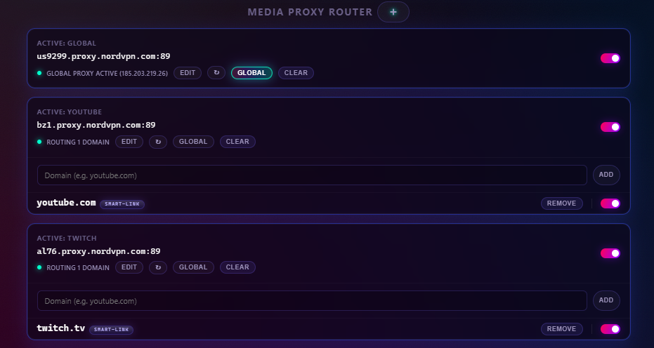
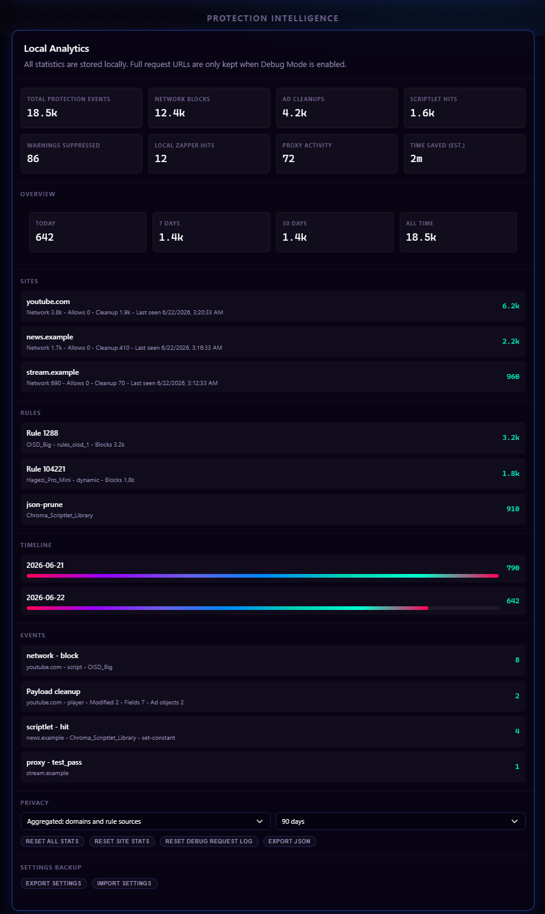

# Feature Guide

This guide expands the feature summary from the root README and explains how Chroma's user-facing protection layers behave.

## Master Protection Lifecycle

The global master switch controls active protection rather than erasing requested settings. Master off removes active network and whitelist DNR, unregisters Chroma-managed subscription and advanced `userScripts`, releases proxy PAC routing, clears Chroma-owned WebRTC/browser-privacy/geolocation settings, and keeps recipe/platform MAIN behavior inert. Cached subscription rules, proxy records, feature toggles, and user resources remain stored.

Master on restores the latest requested state from those caches and settings. Startup and service-worker recovery use the same reconciliation paths, and generation checks prevent an older refresh or registration operation from overwriting a newer toggle. A subscription refresh may update cached data while protection is off, but it cannot reactivate an inactive runtime layer.

## YouTube Ad Stripping

Chroma's primary YouTube defense intercepts and cleans ad-related metadata from JSON payloads before they reach the player. This includes sponsored Shorts overlay payloads and player ad metadata. The goal is a seamless, high-performance viewing experience without relying on playback acceleration.

For the full platform-specific breakdown, see [YouTube Protection](YOUTUBE.md).

## Split-Tunnel Proxy Router

Chroma can route selected media domains through a user-configured HTTP, HTTPS, SOCKS4, or SOCKS5 proxy while keeping unrelated browser traffic direct. It is designed for media-site routing: sending supported services through proxy regions that reduce ad serving or match country-specific media delivery.

  

The router includes:

- Domain-specific proxy overrides.
- Global Proxy Fallback for unmatched browser traffic.
- Smart-Link expansion through a fixed map of known media and CDN domains.
- Real-time connection verification.
- Local-only proxy credential handling for HTTP/HTTPS authentication.
- A default direct-connect list for selected Google/Chrome-related domains. It applies to page traffic as well as browser services and takes precedence whenever Chroma proxy routing is active, including domain-only routes.
- WebRTC leak protection controls.

Master off pauses every proxy route and releases Chrome proxy control while preserving the configured routes. Health separates requested routes from effective Chrome routing, reports another extension or policy as **Controlled elsewhere**, and automatically reconciles after control is released.

For the full proxy manual, see [Media Proxy Router](MEDIA_PROXY_ROUTER.md).

## Source-Generated DNR Network Blocking

Chroma selects OISD Small and Big first, then fills otherwise-unused static capacity with a stable cross-list selection of adult and shock-site domains from OISD NSFW. Protected custom and recipe layers bring the packaged corpus to exactly 300,000 static rules, while runtime dynamic rules add user-configurable blocking at the browser engine level.

DNR blocking is central to Chroma's MV3 design because request decisions can be enforced by Chromium without waking the extension service worker for every network request.

## Tracking URL & AMP Cleanup

Tracking URL Cleanup removes known tracking query parameters from top-level navigation URLs with DNR redirect rules. Examples include `utm_*`, `fbclid`, `gclid`, and similar campaign IDs.

De-AMP Links is optional and disabled by default. When enabled, Chroma redirects supported Google AMP viewer and AMP cache URLs to publisher URLs while respecting current-site and target-domain whitelists.

## Live Filter List Subscriptions

Chroma subscribes to Hagezi Pro Mini, EasyList, Fanboy Annoyance, and the bundled Chroma Scriptlet Library. Subscription rules are parsed locally, cached for restoration, deduplicated where appropriate, and routed to an active layer that can enforce them:

- Network rules can become DNR dynamic rules.
- Cosmetic rules feed the cosmetic filtering layer.
- Supported scriptlet rules feed the `userScripts` engine.
- Unsupported or malformed rules are dropped instead of guessed at.

For custom subscription behavior and MV3 rule budgeting, see [Filter List Subscriptions](FILTER_LISTS.md).

## Scriptlet Injection Engine

Chroma's scriptlet layer uses Chrome's `userScripts` API to run supported scriptlets in the page context at the right lifecycle point. It translates supported uBlock Origin and AdGuard syntax into native JavaScript.

Capabilities include JSON pruning, property-read aborts, constant setting, fetch prevention, regex translation, and explicit timing flags such as `document_start`, `document_idle`, and `document_end`.

Advanced users can also add their own uBO-style scriptlet resource URLs in settings, then save matching rules such as `example.com##+js(resource-name)`. These user-provided resources are not bundled with Chroma and are separate from normal filter list subscriptions; add only resources you trust. For setup examples and linked-resource troubleshooting, see [Advanced User Scriptlets](ADVANCED_USER_SCRIPTLETS.md).

Subscription and advanced scripts require master protection. Turning it off unregisters all Chroma-managed `userScripts` for future documents while retaining their rules and resources for restoration. Whitelisted domains are excluded when registrations are active. Already-executed arbitrary page code may require a tab reload to remove its effects.

### Quiet Console

Quiet Console is off by default. Chroma does not register its page-context helper unless Quiet Console is turned on and master protection is enabled. Turning it off unregisters the helper for new documents; already-open tabs that received the helper need a reload to remove that page-context code. When enabled, it reduces adblock-related noise in page DevTools by catching handled scriptlet and fingerprint warnings and short-circuiting known ad/tracker `fetch`, `XMLHttpRequest`, and `sendBeacon` calls. It does not rewrite DOM resource URLs such as script, image, iframe, or stylesheet sources, so Chrome may still show browser-generated resource-failure rows for blocked subresources. Coarse local diagnostics remain available to the extension.

## Cosmetic Filtering Layer

The cosmetic layer removes ad slots, placeholders, unwanted UI, and unsolicited overlay dialogs through CSS injection and DOM mutation monitoring. It is optimized for YouTube and Twitch, where server-side ad insertion or platform UI behavior can leave page clutter even when network blocking is active.

Controls include:

- Hide Shorts modules.
- Hide Merchandise panels.
- Hide Movie/TV offer modules.
- Suppress browser-configuration warning overlays.
- Apply local cosmetic rules from Element Zapper.

## Element Zapper

The Element Zapper is a manual cleanup tool for one-off annoyances that filter lists do not catch: sticky banners, leftover ad containers, newsletter blocks, floating widgets, and site-specific clutter.

To use it:

1. Open the Chroma popup on an `http://` or `https://` page.
2. Click **Zap Element**.
3. Click the unwanted page element. Press `Esc` to cancel.
4. Review the selector prompt and save it.

Zapper rules are local to your browser and stored as cosmetic rules with a `zapper` source. Chroma rejects invalid selectors and warns when a selector matches too many elements, helping avoid accidental broad hiding. Saved rules can be toggled or deleted from settings at any time.

## Main-World Interceptor Safety Exclusions

Chroma bypasses its generic MAIN-world interceptor and bridge on critical infrastructure, including listed financial institutions, authentication providers, and sensitive TLDs such as `.gov`, `.mil`, `.edu`, and `.int`.

Broader network, cosmetic, and scriptlet behavior remains governed by user settings, subscriptions, and per-domain whitelisting.

## Recipe & Blog Optimization

Chroma provides specialized protection for high-clutter recipe and lifestyle sites. It prevents ad scripts from breaking site layouts, preserves recipe card content, and suppresses aggressive anti-adblock overlays and scroll locks.

The layer includes style protection, semantic recipe content preservation, anti-adblock containment, scroll-lock recovery, and site-specific cosmetic overrides for major recipe platforms.

Recipe behavior waits for authenticated configuration and remains inert while master protection is off or the site is whitelisted. Live deactivation disconnects observers, cancels sweeps, removes Chroma-owned styles, and restores only API slots and page styles Chroma still owns, preserving later page changes. Re-enabling does not stack duplicate wrappers or stylesheets.

## Dynamic Ad Acceleration

Dynamic Ad Acceleration identifies and accelerates YouTube video ads at a configurable speed (`x4`, `x8`, `x12`, or `x16`, default `x8`). It is a fallback for cases where stripping is disabled or platform behavior changes.

It ships off by default. The Amazon Prime Video accelerator is temporarily disabled while its implementation is brought up to the extension's current quality bar. Twitch uses server-side ad insertion and does not support this acceleration path.

For platform-specific behavior, see [YouTube Protection](YOUTUBE.md).

## Privacy Hardening & Fingerprint Randomization

Chroma includes optional browser privacy controls:

- Block third-party cookies.
- Keep Do Not Track disabled.
- Disable supported Privacy Sandbox ad APIs.
- Block website geolocation access through Chrome's native site setting.
- Apply WebRTC leak protection modes.
- Randomize or farble supported fingerprint surfaces per document.

Do Not Track remains disabled deliberately: the [W3C retired the DNT specification](https://www.w3.org/standards/history/tracking-dnt/), sites are not required to honor the signal, and sending an uncommon preference can add another observable browser difference without reliably preventing tracking.

Fingerprint Randomization covers surfaces such as canvas, audio, WebGL, navigator hardware fields, and normalized language APIs. It uses fresh non-persisted salts and full-hostname domain separation.

Browser Privacy Hardening, Geolocation Protection, WebRTC modes, and Fingerprint Randomization require master protection in addition to their own feature settings. Master off releases or unregisters Chroma-owned runtime controls without erasing requested values; master on restores them. Health distinguishes requested, controlled, and effective Chrome state and automatically retries when an external controller releases a setting.

These features are optional because browser privacy hardening and fingerprint changes can affect site compatibility.

## Local Event Tracker

The settings page includes a local-only statistics dashboard for Protection Events, top domains, rule sources, timelines, and recent event summaries. It distinguishes network blocks from allow/whitelist matches. MAIN-world YouTube and scriptlet diagnostics accept only coarse, bounded event types, so those page-layer totals are approximate rather than authenticated enforcement evidence.

  

For retention, privacy modes, and export behavior, see [Statistics & Health](STATISTICS.md).

## Platform Compatibility

Chroma is designed for Windows, macOS, and Linux versions of Google Chrome 122+ and other Chromium-based browsers with engine version 122+. Chrome 122 is Chroma's declared minimum supported version across its feature set; the 12-part static ruleset alone does not require Chrome 122.

Chrome 138+ also requires users to enable **Allow User Scripts** on Chroma's extension details page. Chrome 122-137 uses Developer Mode to enable the `userScripts` API.

---

Next: [YouTube Protection](YOUTUBE.md)
