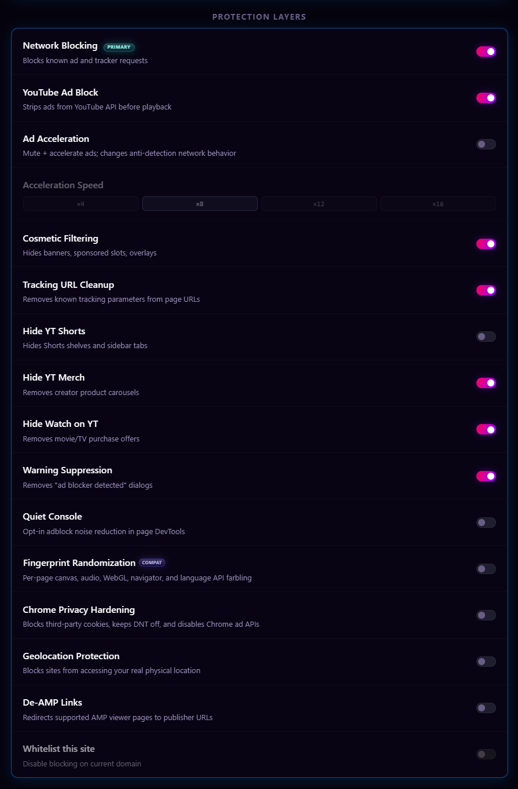
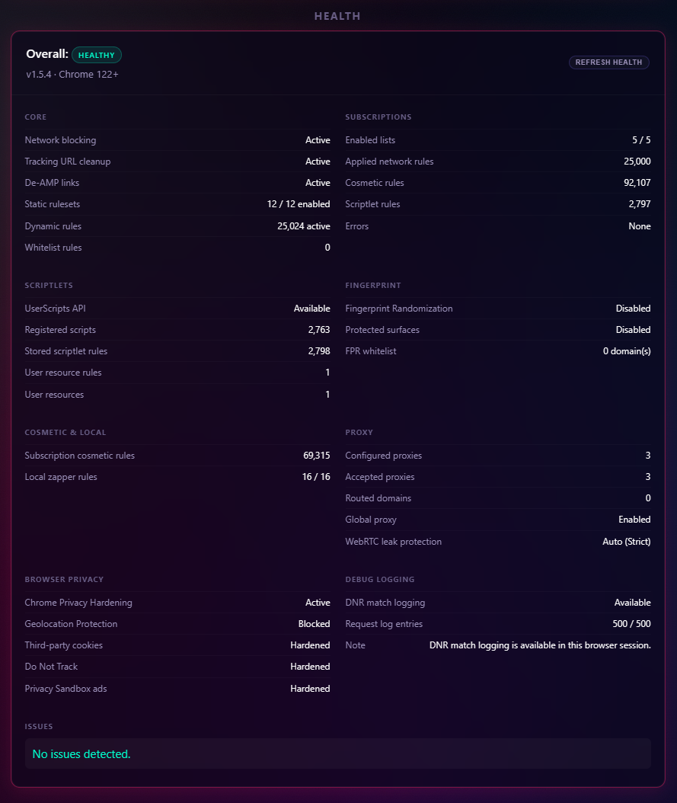

# Installation & Configuration

This guide covers installing Chroma, enabling required browser features, troubleshooting common issues, and understanding the main settings.

## Quick Start

1. Get the latest release from [GitHub Releases](https://github.com/Dabrogost/Chroma-Ad-Blocker/releases/latest), and extract the ZIP file.
2. Open `chrome://extensions` in Chrome.
3. Toggle on **Developer Mode** in the top-right corner.
4. Click **Load unpacked** and select the extracted folder that contains `manifest.json`.
5. Enable User Scripts support:
   - **Chrome 138+**: On the Chroma extension card, click **Details**, then enable **Allow User Scripts**.
   - **Chrome 122-137**: The **Developer Mode** toggle from step 3 enables the `userScripts` API.
6. Chroma is active on all tabs. Pin it from the extensions menu to access the popup.

## Updating Chroma

Chroma is installed unpacked, so updates are handled through the same local folder Chrome already loads. Keeping that folder path the same helps preserve the extension ID, settings, and local statistics.

Normal popup and settings loads use a cached GitHub release check for up to 6 hours. The **Check Latest Release** button forces a fresh check when you want to test a new release immediately.

When Chroma detects a newer GitHub release with the expected direct package asset and signed `updates.json`, the popup shows an update banner. Click it to open **Settings -> Updates**, then:

1. Check the latest release. The popup handoff may already have this information, but this button verifies the direct GitHub ZIP asset and `updates.json` again.
2. Choose the current unpacked Chroma folder, the one that contains `manifest.json`.
3. Approve Chrome's folder picker prompt when it appears. Chroma stores the directory handle locally so future update checks can reuse it when the browser still grants access.
4. Inspect the package ZIP. Chroma downloads signed `updates.json` and the release package into memory, verifies the Chroma signature and expected SHA-256, checks the manifest, rejects unsafe ZIP paths, and confirms manifest-referenced files are present. Users do not manually download `updates.json`, and guided updates do not use Chrome's Downloads permission or download dialog.
5. Build the install plan. This is a dry run that shows files to add, overwrite, remove, and ignore.
6. Run the write probe. Chroma creates and removes a small temporary probe file to confirm write access.
7. Install the update. Chroma creates a temporary backup, writes the verified package into the selected folder, removes stale files from the plan, writes `manifest.json` last, and attempts rollback if installation fails.
8. Click **Reload Chroma** to load the updated files. If direct reload is unavailable, Chroma opens `chrome://extensions` as a fallback.

If Chroma is already current, the Updates panel settles on **Chroma Is Current** instead of walking through install steps. You can still keep the install folder verified for the next update.

If the popup says the update is available **on GitHub** instead of **guided install**, the release does not expose the exact `chroma-ad-blocker-vX.Y.Z.zip` asset and signed `updates.json` needed for the guided updater. Use the manual flow below.

### Manual Update Fallback

1. Download the latest `chroma-ad-blocker-vX.Y.Z.zip` from [GitHub Releases](https://github.com/Dabrogost/Chroma-Ad-Blocker/releases/latest).
2. Extract it to a temporary folder.
3. Back up your current unpacked Chroma folder.
4. Copy the extracted package contents over the current Chroma folder, keeping `manifest.json` at the folder root.
5. Open `chrome://extensions` and click Chroma's refresh button.

If Chrome prompts for folder access again after a restart, choose the same unpacked Chroma folder and rerun the write probe. The prompt is part of Chromium's File System Access API, not a hidden Chrome settings page.

## Configuration

  

| Setting | Description | Default |
|---|---|---|
| `enabled` | Global protection switch. Off removes active DNR/whitelist rules, unregisters Chroma-managed `userScripts`, releases proxy and Chrome privacy controls, and deactivates reversible MAIN behavior while preserving requested settings and caches for restoration. | `true` |
| `networkBlocking` | Enables DNR ruleset blocking. | `true` |
| `trackingUrlCleanup` | Removes known tracking query parameters from top-level navigation URLs. | `true` |
| `deAmpLinks` | Redirects supported AMP viewer pages to publisher URLs. | `false` |
| `stripping` | Enables YouTube Ad Stripping, the primary blocker. | `true` |
| `acceleration` | Enables accelerated ad playback as a fallback. | `false` |
| `accelerationSpeed` | Playback rate multiplier for accelerated ads (`x4`, `x8`, `x12`, or `x16`). | `8` |
| `cosmetic` | Enables hiding ad placeholders through CSS. | `true` |
| `localCosmeticRules` | Stores locally created Element Zapper cosmetic rules. | `[]` |
| `hideShorts` | Removes Shorts component modules. | `false` |
| `hideMerch` | Removes Merchandise panels. | `true` |
| `hideOffers` | Removes Movie/TV offer modules. | `true` |
| `suppressWarnings` | Removes unsolicited overlay dialogs that restrict content access. | `true` |
| `quietConsole` | Optional DevTools noise reduction. When enabled with master protection on, Chroma registers a page-context helper for known ad/tracker `fetch`, `XMLHttpRequest`, and `sendBeacon` noise. | `false` |
| `whitelist` | Stores domains where Chroma blocking is disabled. The current-site popup toggle updates this list. | `[]` |
| `globalProxyEnabled` | Requests browser-level fallback routing through the selected proxy when no domain-specific proxy rule matches and master protection is enabled. | `false` |
| `globalProxyId` | Stores the selected global fallback proxy ID. | `null` |
| `chromeServiceProxyBypass` | Lets Chrome-owned browser services connect directly while Global Proxy Fallback is enabled. | `true` |
| `webRtcLeakProtection` | Requests Chrome's WebRTC IP handling policy (`off`, `auto`, `balanced`, or `strict`) while master protection is enabled. | `auto` |
| `fingerprintRandomization` | Requests per-document canvas, audio, WebGL, navigator, and language API farbling while master protection is enabled, with full-hostname domain separation. | `false` |
| `browserPrivacyHardening` | Requests Chrome privacy settings for third-party cookies, Do Not Track, and Privacy Sandbox ad APIs while master protection is enabled. | `false` |
| `geolocationProtection` | Requests blocking of website geolocation through Chrome's native location setting while master protection is enabled. | `false` |

Master off pauses active protection but does not rewrite the requested values in this table. Re-enable, startup, and worker recovery reconcile the latest stored requests back into DNR, `userScripts`, proxy, WebRTC, browser-privacy, and geolocation runtime state.

## Settings Backup And Import

Settings export writes a versioned `chroma-settings` JSON backup containing validated configuration, whitelists, proxy definitions without credentials, custom-subscription definitions without cached list data, and Advanced User Scriptlet URLs/rules without cached executable code.

Import is transactional:

1. Chroma validates the exact schema/version and every section before mutation. Unknown config keys, malformed domains, invalid proxy or remote-source definitions, and malformed user-scriptlet rules fail without replacing existing state.
2. It snapshots all affected storage keys and builds a complete staged storage image.
3. It commits related keys together, then reconciles DNR/subscription aggregates, `userScripts`, proxy, WebRTC, browser privacy, and geolocation state.
4. A commit or reconciliation failure triggers restoration of the old snapshot and reconciliation of the previous runtime. If either storage or runtime rollback is incomplete, the returned error says so rather than reporting success.

Imported custom subscriptions and Advanced User Scriptlet URLs must be refreshed because backups intentionally omit their cached remote content. See [Filter List Subscriptions](FILTER_LISTS.md#protection-lifecycle-and-cached-restoration) and [Advanced User Scriptlets](ADVANCED_USER_SCRIPTLETS.md#backup-behavior).

## Troubleshooting Quick Reference

| Symptom | Check |
|---|---|
| Scriptlets or fingerprint randomization show unavailable in Health. | On Chrome 138+, open `chrome://extensions`, select Chroma **Details**, and enable **Allow User Scripts**. On Chrome 122-137, confirm **Developer Mode** is enabled. |
| Quiet Console is off but an already-open tab still behaves differently. | Reload that tab. Turning Quiet Console off unregisters the page helper for new documents, but Chrome cannot remove page-context code that already ran in an existing document. |
| Quiet Console is on but DevTools still shows blocked resource rows. | Chrome can still log browser-generated failures for blocked subresources. Quiet Console only handles known scriptlet/fingerprint warnings and known ad/tracker `fetch`, `XMLHttpRequest`, and `sendBeacon` paths. |
| Guided updater is unavailable. | Use a recent Chromium browser with the File System Access directory picker, or use the manual update fallback. |
| Guided updater reports a missing release ZIP or `updates.json`. | The GitHub release must include the exact direct asset name `chroma-ad-blocker-vX.Y.Z.zip` and signed `updates.json`. Use the manual fallback or wait for a corrected release asset. |
| Guided updater reports an invalid update signature. | The release `updates.json` was not signed with Chroma's bundled update key, or it was changed after signing. Use the manual fallback or wait for a corrected release asset. |
| Guided updater says Chroma is current. | No newer release is available for this install. Use **Check Latest Release** to force a fresh GitHub release check if a new release was just published. |
| Guided install completes but the old version still runs. | Click **Reload Chroma** in the updater panel. If direct reload is unavailable, open `chrome://extensions` and click Chroma's refresh button. |
| Loaded-extension E2E tests fail with `--load-extension` errors. | Use Chrome for Testing or Chromium for automated extension tests. Modern official Google Chrome builds reject this automation path. |
| Authenticated SOCKS proxy credentials do not work. | Chromium extension proxy APIs do not expose SOCKS username/password auth to extensions. Use provider-side IP allowlisting or an HTTP/HTTPS proxy endpoint. |
| Proxy or privacy Health status says **Controlled elsewhere**. | Another extension or browser policy owns that Chrome setting. Chroma keeps requested intent, reports it as ineffective/degraded, and automatically retries when control is released. |
| Subscription refresh fails. | Confirm the list URL is HTTPS, reachable, not credential-bearing, under the response-size limit, and returns filter-list text rather than an HTML error page. Chroma blocks literal private/special-use addresses but cannot validate DNS-resolved peer IPs; add only trusted sources. |
| A site fix requires extension changes. | Chroma checks GitHub releases and notifies you when an update is available. Use the guided updater when the exact release ZIP is available, or install the reviewed release package manually. |
| Request Log is empty. | Chroma is installed unpacked, so DNR match logging should normally be available when Chrome exposes `chrome.declarativeNetRequest.onRuleMatchedDebug`. If the browser does not expose that feedback API, blocking can still work normally. |

## Health Panel

The settings page includes a **Health** panel for diagnostics. It shows whether each protection layer is active, disabled, degraded, unavailable, or in an error state.

  

It covers static DNR rulesets, dynamic rules, tracking URL cleanup, De-AMP redirects, subscriptions, cosmetic filtering, scriptlets, fingerprint randomization, browser privacy hardening, geolocation, WebRTC, proxy routing, whitelists, and request-log/debug availability.

Health separates stored/requested intent from Chroma ownership and effective browser state. Master-paused requests are shown as paused rather than mismatches, while another extension or policy is shown as externally controlled/degraded.

The panel is diagnostic-only. It reports counts and coarse status information, but does not expose proxy credentials, stored auth data, request URLs, raw filter rules, or request-log contents.

DNR match logging is shown separately because it depends on Chrome exposing `chrome.declarativeNetRequest.onRuleMatchedDebug` to the unpacked extension. When that feedback API is unavailable, blocking can still work normally.

For deeper local analytics behavior, see [Statistics & Health](STATISTICS.md).

---

Next: [Feature Guide](FEATURES.md)
