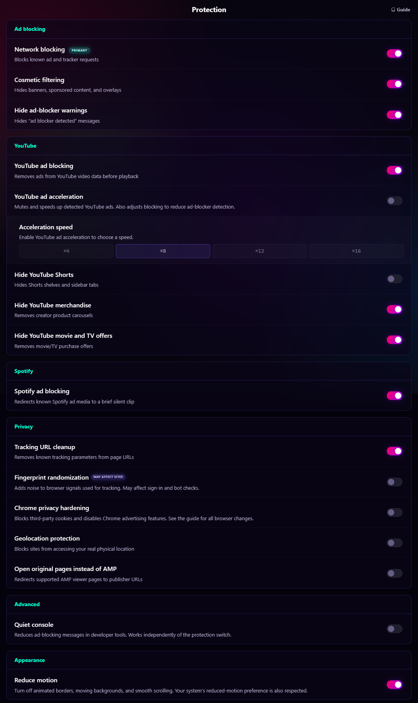
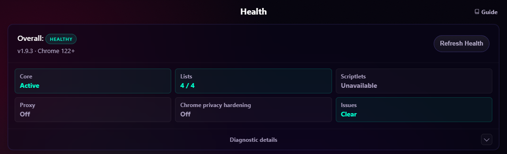

# Installation & Configuration

This guide covers installing Chroma, enabling required browser features, troubleshooting common issues, and understanding the main settings.

## Quick Start

1. Get the latest release from [GitHub Releases](https://github.com/Dabrogost/Chroma-Ad-Blocker/releases/latest), and extract the ZIP file.
2. Open `chrome://extensions` in Chrome or `edge://extensions` in Microsoft Edge.
3. Toggle on **Developer Mode** in the top-right corner.
4. Click **Load unpacked** and select the extracted folder that contains `manifest.json`.
5. Enable User Scripts support:
   - **Chrome 138+**: On the Chroma extension card, click **Details**, then enable **Allow User Scripts**.
   - **Chrome 122-137**: The **Developer Mode** toggle from step 3 enables the `userScripts` API.
6. Chroma's network rules begin applying immediately to eligible requests. Reload tabs that were already open so page-side features such as cosmetic filtering, scriptlets, and platform handlers can initialize. Chrome-internal and other browser-restricted pages cannot run those page-side features. Pin Chroma from the extensions menu to access the popup.

## Updating Chroma

Chroma is installed unpacked, so updates are handled through the same local folder Chrome already loads. Keeping that folder path the same helps preserve the extension ID, settings, and local statistics.

Normal popup and settings loads use a cached GitHub release check for up to 6 hours. The **Check Latest Release** button forces a fresh check when you want to look for a newly published release immediately.

When Chroma detects a newer release, the popup shows an update banner. Click it to open **Settings -> Updates**. If guided installation is available:

1. Click **Check Latest Release**.
2. Click **Choose Chroma Folder** and select the folder you originally loaded into Chrome, containing `manifest.json`. Select the installed folder, not a backup or a new download.
3. Approve the browser's folder-access prompt.
4. Click **Inspect Package ZIP**. Chroma downloads and verifies the signed release package automatically.
5. Click **Build Install Plan** and review the files to be changed.
6. Click **Run Write Probe** to confirm Chroma can write to the folder.
7. Install the update. Chroma backs up affected files and attempts to restore them if installation fails.
8. Click **Reload Chroma** to load the updated files. If direct reload is unavailable, Chroma opens `chrome://extensions` as a fallback.

If the panel shows **Chroma Is Current**, no update is needed.

If the popup links to an update **on GitHub** without offering **guided install**, use the manual update steps below for a trusted GitHub release.

Do not use the manual flow to bypass a failed signature, hash, package, or manifest verification. A verification failure means Chroma could not authenticate that release package; stop and wait for a corrected release.

### Manual Update Fallback

Manual updates do not receive the guided updater's signature verification. Download the package from Chroma's GitHub releases.

1. Download the latest `chroma-ad-blocker-vX.Y.Z.zip` from [GitHub Releases](https://github.com/Dabrogost/Chroma-Ad-Blocker/releases/latest).
2. Extract it to a temporary folder.
3. Back up your current unpacked Chroma folder.
4. Copy the extracted package contents over the current Chroma folder, keeping `manifest.json` at the folder root.
5. Open `chrome://extensions` and click Chroma's refresh button.

If the guided updater asks for folder access again after a browser restart, select the same installed Chroma folder and rerun the write probe.

## Settings Navigation And Controls

Protection controls are grouped under **Ad blocking**, **YouTube**, **Spotify**, **Privacy**, **Advanced**, and **Appearance**. Use the navigation links to jump to a section.

The master switch shows whether protection is on or off. Wait for a pending save to finish before making another change; a failed save displays an error. Enable both master protection and **YouTube ad acceleration** to choose an acceleration speed.

Under **Appearance**, **Reduce motion** turns off animated borders, moving backgrounds, and smooth scrolling. The preference persists locally, and the system's reduced-motion preference is respected even when the toggle is off. This UI preference is separate from protection and is not included in settings backups.

Use Tab to move between controls and navigation links. Focus indicators show the selected control, and the request log can be expanded with Enter or Space.

Use the **popup** to change protection for the current site. Open **Settings -> Backup -> Backup and restore** to export or import settings.

## Configuration

  

| Setting | Description | Default |
|---|---|---|
| `enabled` | Global protection switch. Off removes active DNR/whitelist rules, unregisters Chroma-managed `userScripts`, releases proxy and Chrome privacy controls, and deactivates reversible MAIN behavior while preserving requested settings and caches for restoration. | `true` |
| `networkBlocking` | Enables DNR ruleset blocking. | `true` |
| `trackingUrlCleanup` | Removes known tracking query parameters from top-level navigation URLs. | `true` |
| `deAmpLinks` | Redirects supported AMP viewer pages to publisher URLs. | `false` |
| `stripping` | Enables YouTube Ad Stripping, the primary blocker. | `true` |
| `spotifyAdBlocking` | Redirects known Spotify ad media to a packaged silent clip without changing playback data. Independent of YouTube and Network Blocking; respects master protection and the site whitelist. | `true` |
| `acceleration` | Enables accelerated ad playback as a fallback. | `false` |
| `accelerationSpeed` | Playback rate multiplier for accelerated ads (`x4`, `x8`, `x12`, or `x16`). | `8` |
| `cosmetic` | Enables hiding ad placeholders through CSS. | `true` |
| `localCosmeticRules` | Stores locally created Element Zapper cosmetic rules. | `[]` |
| `hideShorts` | Removes Shorts component modules. | `false` |
| `hideMerch` | Removes Merchandise panels. | `true` |
| `hideOffers` | Removes Movie/TV offer modules. | `true` |
| `suppressWarnings` | Removes unsolicited overlay dialogs that restrict content access. | `true` |
| `quietConsole` | Optional DevTools noise reduction. When enabled with master protection on, Chroma registers a page-context helper for known ad/tracker `fetch`, `XMLHttpRequest`, and `sendBeacon` noise. | `false` |
| `whitelist` | Stores domains where Chroma blocking is disabled. The current-site popup toggle updates this list. | `[]` |
| `globalProxyEnabled` | Requests browser-level fallback routing through the selected proxy when no domain-specific proxy rule matches and master protection is enabled. | `false` |
| `globalProxyId` | Stores the selected global fallback proxy ID. | `null` |
| `chromeServiceProxyBypass` | Direct-connects a fixed list of Google/Chrome-related hostnames whenever Chroma proxy routing is active. The list applies to page traffic as well as browser services and takes precedence over domain-specific and global routes. | `true` |
| `webRtcLeakProtection` | Requests Chrome's WebRTC IP handling policy (`off`, `auto`, `balanced`, or `strict`) while master protection is enabled. | `auto` |
| `fingerprintRandomization` | Requests per-document canvas, audio, WebGL, navigator, and language API farbling while master protection is enabled, with full-hostname domain separation. | `false` |
| `browserPrivacyHardening` | Requests Chrome privacy settings for third-party cookies, Do Not Track, and Privacy Sandbox ad APIs while master protection is enabled. | `false` |
| `geolocationProtection` | Requests blocking of website geolocation through Chrome's native location setting while master protection is enabled. | `false` |

Master off pauses active protection but does not rewrite the requested values in this table. Re-enable, startup, and worker recovery reconcile the latest stored requests back into DNR, `userScripts`, proxy, WebRTC, browser-privacy, and geolocation runtime state.

## Settings Backup And Import

Open **Settings -> Backup -> Backup and restore** to export or import a settings file. The section displays export, import, and validation feedback. The local Reduce motion preference is not included in this backup.

Settings export writes a versioned `chroma-settings` JSON backup containing validated configuration, whitelists, proxy definitions without credentials, custom-subscription definitions without cached list data, and Advanced User Scriptlet URLs/rules without cached executable code.

Chroma validates the backup before applying it. Invalid or unsupported backups leave your settings unchanged. If applying a valid backup fails, Chroma attempts to restore your previous settings and reports any incomplete restoration.

Imported custom subscriptions and Advanced User Scriptlet URLs must be refreshed because backups intentionally omit their cached remote content. See [Filter List Subscriptions](FILTER_LISTS.md#protection-lifecycle-and-cached-restoration) and [Advanced User Scriptlets](ADVANCED_USER_SCRIPTLETS.md#backup-behavior).

## Troubleshooting Quick Reference

| Symptom | Check |
|---|---|
| Scriptlets or fingerprint randomization show unavailable in Health. | On Chrome 138+, open `chrome://extensions`, select Chroma **Details**, and enable **Allow User Scripts**. On Chrome 122-137, confirm **Developer Mode** is enabled. |
| Quiet Console is off but an already-open tab still behaves differently. | Reload that tab. Turning Quiet Console off unregisters the page helper for new documents, but Chrome cannot remove page-context code that already ran in an existing document. |
| Quiet Console is on but DevTools still shows blocked resource rows. | Chrome can still log browser-generated failures for blocked subresources. Quiet Console only handles known scriptlet/fingerprint warnings and known ad/tracker `fetch`, `XMLHttpRequest`, and `sendBeacon` paths. |
| Guided updater is unavailable. | Use a Chromium browser that supports folder selection, or follow [Manual Update Fallback](#manual-update-fallback) for a trusted GitHub release. Do not use manual installation to bypass a failed package verification. |
| Guided updater reports a missing release ZIP or `updates.json`. | The GitHub release must include the exact direct asset name `chroma-ad-blocker-vX.Y.Z.zip` and signed `updates.json`. Wait for corrected assets, or use the manual fallback only after independently confirming that you trust the release. |
| Guided updater reports an invalid update signature. | Stop and do not install that release, including through the manual fallback. The `updates.json` file was not signed with Chroma's bundled update key or changed after signing; wait for a corrected authenticated release. |
| Guided updater says Chroma is current. | No newer release is available for this install. Use **Check Latest Release** to force a fresh GitHub release check if a new release was just published. |
| Guided install completes but the old version still runs. | Click **Reload Chroma** in the updater panel. If direct reload is unavailable, open `chrome://extensions` and click Chroma's refresh button. |
| Authenticated SOCKS proxy credentials do not work. | Chromium extension proxy APIs do not expose SOCKS username/password auth to extensions. Use provider-side IP allowlisting or an HTTP/HTTPS proxy endpoint. |
| Proxy or privacy Health status says **Controlled elsewhere**. | Another extension or browser policy owns that Chrome setting. Chroma keeps requested intent, reports it as ineffective/degraded, and automatically retries when control is released. |
| Subscription refresh fails. | Confirm the list URL is HTTPS, reachable, not credential-bearing, under the response-size limit, and returns filter-list text rather than an HTML error page. Chroma blocks literal private/special-use addresses but cannot validate DNS-resolved peer IPs; add only trusted sources. |
| A site fix requires extension changes. | Chroma checks GitHub releases and notifies you when an update is available. Prefer the guided updater. Use a reviewed package manually only when guided assets are unavailable, never to bypass a failed verification. |
| Request Log is empty. | Chroma is installed unpacked, so DNR match logging should normally be available when Chrome exposes `chrome.declarativeNetRequest.onRuleMatchedDebug`. If the browser does not expose that feedback API, blocking can still work normally. |

## Health Panel

For Spotify ads or playback errors, see [Spotify troubleshooting](SPOTIFY.md#troubleshooting-playback). Its dedicated toggle is independent of general Network blocking. Fresh installs enable it; older configurations without a saved Spotify preference leave it off until explicitly enabled.

The settings page includes a **Health** panel for diagnostics. It shows whether each protection layer is active, disabled, degraded, unavailable, or in an error state.

  

It covers static DNR rulesets, dynamic rules, tracking URL cleanup, De-AMP redirects, subscriptions, cosmetic filtering, scriptlets, fingerprint randomization, browser privacy hardening, geolocation, WebRTC, proxy routing, whitelists, and request-log/debug availability.

Health separates stored/requested intent from Chroma ownership and effective browser state. Master-paused requests are shown as paused rather than mismatches, while another extension or policy is shown as externally controlled/degraded.

The panel is diagnostic-only. It reports counts and coarse status information, but does not expose proxy credentials, stored auth data, request URLs, raw filter rules, or request-log contents.

DNR match logging is shown separately because it depends on Chrome exposing `chrome.declarativeNetRequest.onRuleMatchedDebug` to the unpacked extension. When that feedback API is unavailable, blocking can still work normally.

For deeper local analytics behavior, see [Statistics & Health](STATISTICS.md).

## Why Not The Chrome Web Store?

Ad blocking on the modern web changes quickly, and trust is the most valuable currency. Chroma is deliberately not hosted on the Chrome Web Store. This is a strategic decision rooted in transparency and technical freedom.

### Conflict Of Interest

Google is an advertising company first. As the gatekeeper of the Chrome Web Store, it has an inherent conflict of interest regarding tools that neutralize its primary revenue stream.

By remaining independent, Chroma is not subject to Chrome Web Store review delays, listing removal, or the store's publication cadence. It remains subject to Chrome and Chromium API changes, Manifest V3 limits, browser policies, and feature deprecations.

### Full Auditability

Web Store extensions often arrive as bundled packages that are harder for ordinary users to inspect. Chroma is distributed as raw, human-readable source code. By loading it as an unpacked extension, users and contributors can audit the JavaScript that is actually running.

There are no hidden analytics, telemetry backdoors, or Acceptable Ads-style paid bypass programs.

### Transparent MV3 API Use

Chroma uses MV3 APIs such as the `userScripts` engine and multi-part `declarativeNetRequest` rulesets within Chromium's permissions and quotas. Release-package distribution does not grant extra browser API power; it keeps the implementation inspectable and allows releases without waiting on store review cycles.

### Fast GitHub Releases

When YouTube or other platforms update their ad-delivery algorithms, Chroma can ship a reviewed GitHub release package quickly. Web Store reviews can take days or weeks. In ad blocking, that delay matters.

Staying off the store helps keep the engine responsive to platform changes while keeping updates tied to inspectable releases.

> [!IMPORTANT]
> Sideloading an extension requires a higher level of trust. Review [Permissions](PERMISSIONS.md) and the [Privacy Policy](PRIVACY_POLICY.md) before installing.

---

Next: [Feature Guide](FEATURES.md)
