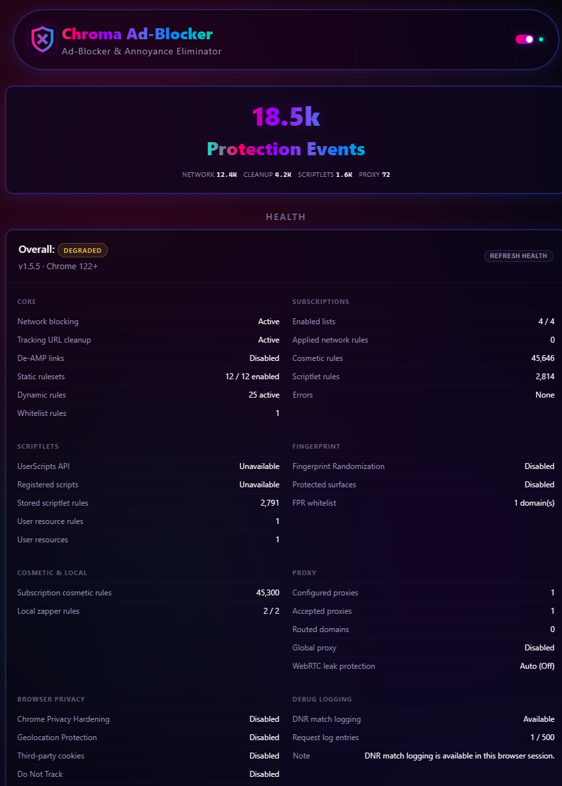

# Chroma Documentation

This directory is the long-form home for Chroma Ad-Blocker. The root [README](../README.md) is the public front door; these docs preserve the deeper implementation notes, trust model, configuration details, and project rationale.

  

## Start Here

- [Installation & Configuration](INSTALL.md) - install Chroma, use guided or manual updates, enable User Scripts, troubleshoot common setup issues, review settings, and understand the Health panel.
- [Feature Guide](FEATURES.md) - expanded feature descriptions for the protection layers, local controls, privacy hardening, and user workflows.
- [Architecture Deep Dive](ARCHITECTURE.md) - diagrams, MV3 execution model, service-worker flow, system layers, and request-path boundaries.
- [Performance Guide](PERFORMANCE.md) - DNR vs JavaScript request-path cost, service-worker lifecycle, page-side overhead, proxy routing, stats batching, and low-overhead settings.
- [Media Proxy Router](MEDIA_PROXY_ROUTER.md) - split-tunnel proxy routing, Global Fallback, Smart-Link expansion, protocol support, WebRTC behavior, and provider setup notes.
- [YouTube Protection](YOUTUBE.md) - YouTube payload stripping, Sponsored Shorts cleanup, feed/search cleanup, and acceleration fallback behavior.
- [Filter List Subscriptions](FILTER_LISTS.md) - bundled and remote list behavior, custom subscriptions, MV3 rule allocation, and third-party credits.
- [Advanced User Scriptlets](ADVANCED_USER_SCRIPTLETS.md) - trusted user-provided scriptlet resources, linked rule status, examples, and troubleshooting.

## Trust, Privacy, And Security

- [Permissions](PERMISSIONS.md) - each requested extension permission and why it exists.
- [Statistics & Health](STATISTICS.md) - local Protection Intelligence, privacy modes, retention, reset/export behavior, and diagnostics.
- [Privacy Policy](PRIVACY_POLICY.md) - local storage, no Chroma telemetry, optional network requests, and third-party service boundaries.
- [Security Policy](SECURITY.md) - disclosure process, remote list trust boundary, isolated-to-MAIN handshake, and security hardening notes.
- [Threat Model](THREAT_MODEL.md) - adversaries, trust assumptions, defended cases, and explicit non-goals.

## Development And Releases

- [Testing](TEST_GUIDE.md) - Node tests, policy tests, and Chrome for Testing / Chromium E2E guidance.
- [Distribution](DISTRIBUTION.md) - packaging the extension ZIP, guided updater asset requirements, and release checks.
- [Contributing](CONTRIBUTING.md) - contribution ground rules and local PR expectations.
- [Terms of Service](ToS.md) - use terms and legal disclaimers.

## Project Context

- [Project Philosophy](PROJECT_PHILOSOPHY.md) - why Chroma exists, why it is not on the Chrome Web Store, companion extensions, alternatives, AI disclosure, and legal notes.
