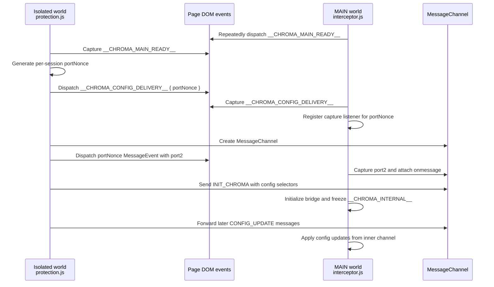

# Security Policy

We take the security of Chroma Ad-Blocker seriously. If you believe you have found a security vulnerability, please follow the disclosure process below.

**Supported Versions**
Currently, only the latest released version of Chroma Ad-Blocker and the `master` branch are actively supported with security updates.

**Reporting a Vulnerability**
If you discover a vulnerability, please send an email to **dabrogost@gmail.com**. Include a description, reproduction steps, and potential impact. (Private Disclosure)

## Safe Harbor
Chroma Ad-Blocker supports responsible security research. We will not pursue legal action against researchers who discover and report vulnerabilities in good faith, provided they: make a reasonable effort to avoid privacy violations or disruption to other users, do not exploit the vulnerability beyond what is necessary to demonstrate it, and report the issue privately before any public disclosure.

## Remote List Trust Boundary

Chroma uses remote filter list subscriptions as part of normal operation. Default remote subscriptions are third-party filter lists such as Hagezi Pro Mini, EasyList, and Fanboy Annoyance. Chroma project fixes are delivered through GitHub release packages, not through a default maintainer-controlled hotfix subscription.

Remote list content is not treated as arbitrary code. Lists are fetched over HTTPS, parsed locally, bounded by response-size and rule-budget limits, deduplicated against bundled static rules where applicable, and unsupported syntax is dropped. Scriptlet rules can only call implementations already shipped in Chroma's bundled scriptlet library.

Because enabled remote lists can still change blocking, allow rules, cosmetic behavior, or supported scriptlet behavior after installation, users who need a stricter trust model should review and disable subscriptions they do not want to trust from Chroma settings. Additional custom subscriptions are always user-selected.

## Advanced User Scriptlet Resources

Chroma supports an advanced, user-initiated scriptlet resource lane for people who want to add uBO-style scriptlet resources themselves. This lane is separate from normal filter list subscriptions:

- Chroma does not bundle these resources.
- Chroma does not activate them through remote filter-list subscriptions.
- Resource URLs must be added explicitly by the user in settings.
- Matching `domain##+js(resource-name)` rules must also be saved by the user.
- Cached resource code is not included in settings backups; backups store only resource URLs and user rules.

User scriptlet resources are executable code. They are fetched from public HTTPS URLs selected by the user, parsed with size and MIME limits, stored locally, and registered through Chrome's documented `userScripts` API in the page MAIN world. This API is the only path Chroma uses for user-provided scriptlet code; Chroma does not use `eval`, `Function`, or extension-controlled remote script execution for this feature.

Users should add only resources they trust. Health diagnostics report counts and coarse status for this feature without exposing raw resource code.

## Security Hardening

Chroma implements several security measures to preserve extension integrity and reduce the amount of page-visible state:

- **Closure-Scoped Session State**: Session tracking variables in the acceleration handlers are private to the IIFE closure. Host-page scripts cannot read or modify acceleration state, session flags, or ad counters.
- **Config Update Validation**: Incoming configuration updates, whether from the popup or a `__CHROMA_CONFIG_UPDATE__` CustomEvent, are validated against a strict key allowlist with type and range checks. Invalid values are rejected before reaching the internal config object.
- **Immutable API Bridge**: Internal utilities are exposed through a locked `__CHROMA_INTERNAL__` object protected with `Object.defineProperty`, `writable: false`, and `configurable: false`, preventing host pages from replacing extension logic.
- **Pristine API Caching**: `interceptor.js` captures and freezes native browser APIs, such as `querySelector`, `setTimeout`, and `Function.prototype.toString`, at `document_start`. This lets the extension use trusted original functions even if a site later attempts prototype pollution.
- **Dead Man's Switch**: If core native APIs fail integrity checks at startup, the interceptor severs its secure port and falls back to safe defaults instead of operating in a potentially compromised environment.
- **Sentinel Hardening**: Internal activation state is managed through private closure state and `WeakMap`-style markers so host-page scripts cannot observe or tamper with lifecycle markers after initialization.
- **Secure Config Handshake**: A short-lived, per-load `MessageChannel` moves verified configuration and selector sets from the isolated world to the MAIN world through a randomized transfer nonce.
- **Origin Authentication**: The background service worker validates origin and sender context for privileged messages, rejecting sensitive data or configuration requests from outside the verified extension context.

## Isolated-To-MAIN Handshake

Chroma uses an isolated-world content script to read extension state and a MAIN-world interceptor to preserve page-native APIs before host scripts can tamper with them. The two worlds exchange configuration over a short-lived, per-load `MessageChannel` transfer instead of leaving a predictable page-visible channel open.

The nonce makes the transfer event name unpredictable for each page load, while capture-phase listeners stop the setup events from continuing through page listeners. If the MAIN-world environment looks compromised before the transfer, the secure relay is not provisioned.

## Disclosure Process

We value the work of developers and security researchers. Once a report is received:

1.  **Acknowledgment**: We will acknowledge your report as quickly as possible.
2.  **Investigation**: We will investigate the issue and determine the potential impact.
3.  **Resolution**: We will work on a fix and release an update via the GitHub repository.

> [!IMPORTANT]
> Please do not open public issues for security vulnerabilities. We ask that you follow 
> responsible disclosure practices to protect all users of the extension.

---

Next: [Testing Guide](TEST_GUIDE.md)
