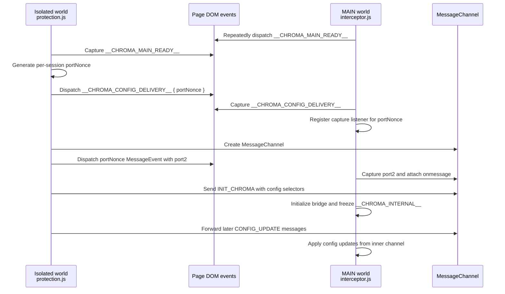

# Security Policy

We take the security of Chroma Ad-Blocker seriously. If you believe you have found a security vulnerability, please follow the disclosure process below.

**Supported Versions**
Currently, only the latest released version of Chroma Ad-Blocker and the `master` branch are actively supported with security updates.

**Reporting a Vulnerability**
If you discover a vulnerability, please send an email to **dabrogost@gmail.com**. Include a description, reproduction steps, and potential impact. (Private Disclosure)

## Safe Harbor
Chroma Ad-Blocker supports responsible security research. We will not pursue legal action against researchers who discover and report vulnerabilities in good faith, provided they: make a reasonable effort to avoid privacy violations or disruption to other users, do not exploit the vulnerability beyond what is necessary to demonstrate it, and report the issue privately before any public disclosure.

## Remote List Trust Boundary

Chroma uses remote filter list subscriptions as part of normal operation. Default remote subscriptions are third-party filter lists such as Hagezi Pro Mini, EasyList, and Fanboy Annoyance. Chroma project fixes are delivered through GitHub release packages, not through a default maintainer-controlled hotfix subscription.

Remote list content is not treated as arbitrary code. Lists are fetched over HTTPS, parsed locally, bounded by response-size and rule-budget limits, deduplicated against bundled static rules where applicable, and unsupported syntax is dropped. Scriptlet rules can only call implementations already shipped in Chroma's bundled scriptlet library.

Because enabled remote lists can still change blocking, allow rules, cosmetic behavior, or supported scriptlet behavior after installation, users who need a stricter trust model should review and disable subscriptions they do not want to trust from Chroma settings. Additional custom subscriptions are always user-selected.

## Isolated-To-MAIN Handshake

Chroma uses an isolated-world content script to read extension state and a MAIN-world interceptor to preserve page-native APIs before host scripts can tamper with them. The two worlds exchange configuration over a short-lived, per-load `MessageChannel` transfer instead of leaving a predictable page-visible channel open.

The nonce makes the transfer event name unpredictable for each page load, while capture-phase listeners stop the setup events from continuing through page listeners. If the MAIN-world environment looks compromised before the transfer, the secure relay is not provisioned.

## Disclosure Process

We value the work of developers and security researchers. Once a report is received:

1.  **Acknowledgment**: We will acknowledge your report as quickly as possible.
2.  **Investigation**: We will investigate the issue and determine the potential impact.
3.  **Resolution**: We will work on a fix and release an update via the GitHub repository.

> [!IMPORTANT]
> Please do not open public issues for security vulnerabilities. We ask that you follow 
> responsible disclosure practices to protect all users of the extension.
