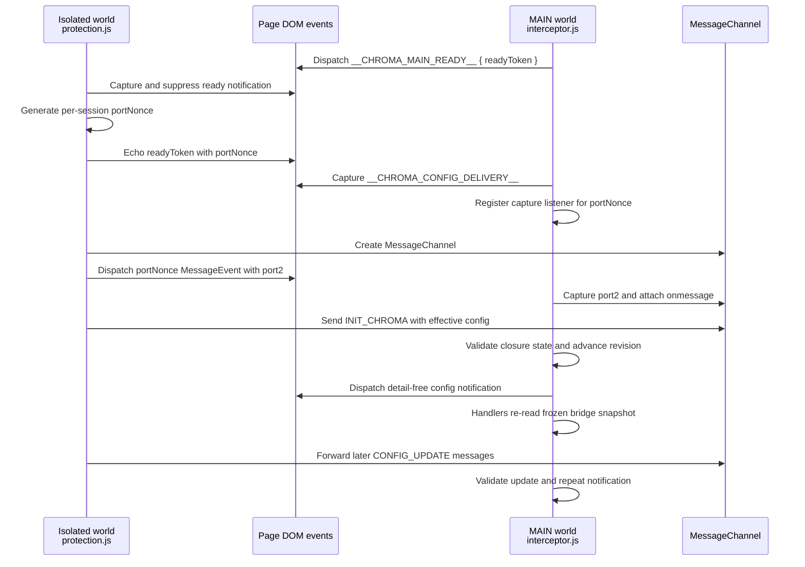

# Security Policy

We take the security of Chroma Ad-Blocker seriously. If you believe you have found a security vulnerability, please follow the disclosure process below.

**Supported Versions**
Currently, only the latest released version of Chroma Ad-Blocker and the `master` branch are actively supported with security updates.

**Reporting a Vulnerability**
If you discover a vulnerability, please send an email to **dabrogost@gmail.com**. Include a description, reproduction steps, and potential impact. (Private Disclosure)

## Safe Harbor

Chroma Ad-Blocker supports responsible security research. This safe harbor covers good-faith testing of Chroma's source code, unpacked extension package, and project-controlled update logic using browser profiles, accounts, folders, proxies, and test data you own or are authorized to use. It does not authorize testing GitHub, browser-vendor infrastructure, proxy providers, websites, or other third-party systems; those parties set their own rules.

We will not pursue legal action for covered research when the researcher:

- Avoids privacy violations, service disruption, social engineering, denial of service, and access to another person's account or data.
- Uses the minimum access needed to demonstrate the issue, does not establish persistence, and does not retain or disclose data encountered accidentally.
- Reports the issue privately before public disclosure and gives the project a reasonable opportunity to investigate and address it.
- Complies with applicable law and stops testing if asked while a safety concern is investigated.

This policy cannot bind third parties or authorize conduct on their systems. Email is not an encrypted reporting channel, so do not send live credentials, private browsing data, update-signing material, or other unnecessary secrets. There is no guaranteed response or remediation deadline; acknowledgment, investigation, remediation, and coordinated disclosure timing depend on severity and maintainer availability.

## Remote List Trust Boundary

Chroma uses remote filter list subscriptions as part of normal operation. Default remote subscriptions are third-party filter lists such as Hagezi Pro Mini, EasyList, and Fanboy Annoyance. Chroma project fixes are delivered through GitHub release packages, not through a default maintainer-controlled hotfix subscription.

Remote list content is not treated as arbitrary code. Lists are fetched over HTTPS, parsed locally, bounded by response-size and rule-budget limits, deduplicated against bundled static rules where applicable, and unsupported syntax is dropped. Scriptlet rules can only call implementations already shipped in Chroma's bundled scriptlet library.

Because enabled remote lists can still change blocking, allow rules, cosmetic behavior, or supported scriptlet behavior after installation, users who need a stricter trust model should review and disable subscriptions they do not want to trust from Chroma settings. Additional custom subscriptions are always user-selected.

## Remote URL Network Boundary

Remote subscriptions and Advanced User Scriptlet resources share one URL policy. URLs must use HTTPS on the default port and cannot contain credentials. Chroma rejects URLs that literally name localhost or private, link-local, loopback, multicast, reserved, or other special-use IPv4/IPv6 addresses. It applies the same literal check to the final response URL before accepting response metadata or body content, including `304 Not Modified` responses.

This is a content-acceptance boundary, not a complete network-egress guarantee. Chromium performs DNS resolution and automatic redirect transport, and Chroma cannot inspect or pin the connection's peer IP through ordinary extension `fetch()`. A public-looking hostname can therefore resolve or rebind to a private address, and Chromium may already contact an automatically followed redirect before Chroma can reject its final URL. HTTPS certificate validation, the default port requirement, and the absence of URL credentials reduce the practical risk but do not remove it. Add only remote sources you trust.

## Guided Update Trust Boundary

Chroma's guided updater installs only GitHub release packages that have the exact expected ZIP asset and signed `updates.json`. The signed manifest binds the package name, byte size, and SHA-256 to Chroma's bundled update public key before the updater builds an install plan or writes files.

Folder access is explicit and user-scoped through Chromium's File System Access picker. Chroma stores the selected directory handle locally for convenience, but the browser may require the user to reconnect that folder after a restart or permission reset. Guided updates do not use Chrome's Downloads permission, do not accept arbitrary update URLs, and do not install from unsigned or same-version packages.

The update private key is not stored in the repository. A missing, unsigned, modified, or incorrectly signed `updates.json` blocks guided installation. An invalid signature is a stop condition: do not install the same release asset manually, because doing so would bypass the safeguard that reported the problem. Wait for a corrected authenticated release or verify the package through an independent trusted channel.

Manual installation is a separate trust path. Chroma's manual copy-and-reload procedure does not itself verify the package against the bundled update key or an independently obtained hash, so a manually downloaded package remains unauthenticated by Chroma unless the user performs independent verification. This limitation applies to first-time installs and every later manual update, not only the first installation.

The bundled public key is a single local trust anchor; there is no online revocation service or automatic key discovery. Keeping the matching private key outside the repository is necessary but does not by itself establish secure custody. Guided-update security depends on restricted private-key access, protected backups, signing-host integrity, and an incident plan. A planned rotation requires a reviewed release that embeds the successor public key before manifests switch to it. If the active private key is suspected to be compromised, clients cannot safely learn a replacement solely from a manifest signed by that key; the replacement release must be authenticated through an independent trusted channel.

## Settings Import Trust Boundary

Settings import accepts only the supported `chroma-settings` schema and exact backup version. Chroma validates the complete configuration, whitelists, proxy records, custom-subscription metadata, and Advanced User Scriptlet URLs/rules before mutation. Malformed scriptlet text or an unsupported backup version fails validation without replacing existing state.

After validation, affected storage keys are committed as one staged image and the authoritative DNR, `userScripts`, proxy, WebRTC, browser-privacy, and geolocation runtimes are reconciled. A commit or reconciliation failure triggers restoration from the pre-import snapshot followed by reconciliation of the previous runtime. The result distinguishes validation, commit, reconciliation, and rollback failures and exposes an incomplete rollback rather than reporting success.

Backups intentionally omit proxy credentials, cached subscription bodies/rules, and cached executable user-resource code. Imported remote sources must be refreshed before their omitted caches can become active.

## Advanced User Scriptlet Resources

Chroma supports an advanced, user-initiated scriptlet resource lane for people who want to add uBO-style scriptlet resources themselves. This lane is separate from normal filter list subscriptions:

- Chroma does not bundle these resources.
- Chroma does not activate them through remote filter-list subscriptions.
- Resource URLs must be added explicitly by the user in settings.
- Matching `domain##+js(resource-name)` rules must also be saved by the user.
- Cached resource code is not included in settings backups; backups store only resource URLs and user rules.

User scriptlet resources are executable code. They are fetched from permitted HTTPS URLs selected by the user, parsed with size and MIME limits, stored locally, and registered through Chrome's documented `userScripts` API in the page MAIN world. This API is the only path Chroma uses for user-provided scriptlet code; Chroma does not use `eval`, `Function`, or extension-controlled remote script execution for this feature. The DNS limitation described in [Remote URL Network Boundary](#remote-url-network-boundary) applies to these sources.

MAIN-world user code can read or alter page-visible DOM, JavaScript state, cookies, storage, and account/session information available to ordinary page JavaScript. It can also initiate network activity or transmit accessible data subject to normal browser and page controls. Chroma does not audit or sandbox the intent of these resources, so users should add only code and source operators they trust and should match it to the narrowest practical domains. Health diagnostics report counts and coarse status for this feature without exposing raw resource code.

For practical setup, examples, and troubleshooting, see [Advanced User Scriptlets](ADVANCED_USER_SCRIPTLETS.md).

## Local Storage Access Boundary

Chroma stores settings, proxy records, cached remote content, statistics, health diagnostics, and request-log URLs in `chrome.storage.local`. Chrome exposes that storage area to the extension service worker, extension pages, and Chroma's isolated-world content scripts by default. Chroma does not currently call `chrome.storage.local.setAccessLevel()` to restrict the area to trusted extension contexts.

Page scripts and ordinary unrelated extensions do not gain direct storage access merely because an isolated content script runs beside them. The remaining blast radius is still broader than the service worker: a vulnerability or unintended data path in a Chroma content script could read storage keys unrelated to that script's normal task. A compromised browser profile, browser binary, operating system, or exceptional debugger-enabled environment capable of inspecting Chroma can also defeat this boundary.

## Security Hardening

Chroma implements several security measures to preserve extension integrity and limit privileged page influence. Some effective configuration state is intentionally page-readable on supported bridge domains and is not treated as a secret:

- **Closure-Scoped Session State**: Session tracking variables in acceleration handlers are private to their closure. Host-page scripts cannot directly read or write that state, although they can observe visible player or DOM behavior and infer that Chroma acted.
- **Config Authority And Validation**: Authoritative configuration arrives only through the selected private `MessagePort` and is validated against a strict key allowlist with type and range checks before updating closure-owned state. `__CHROMA_CONFIG_UPDATE__` carries no authoritative values, so a page-forged notification cannot modify bridge state. On supported bridge domains, however, page scripts can directly read the current frozen `window.__CHROMA_INTERNAL__.config` snapshot and revision; those values are observable status, not confidential state or configuration authority.
- **Immutable API Bridge**: Internal utilities are exposed through a locked `__CHROMA_INTERNAL__` object protected with `Object.defineProperty`, `writable: false`, and `configurable: false`. This prevents ordinary replacement of the bridge but does not hide its enumerable configuration snapshot or APIs from page scripts.
- **Pristine API Caching**: `interceptor.js` captures and freezes native browser APIs, such as `querySelector`, `setTimeout`, and `Function.prototype.toString`, at `document_start`. This lets the extension use trusted original functions even if a site later attempts prototype pollution.
- **Dead Man's Switch**: If core native APIs fail integrity checks at startup, the interceptor severs its secure port and falls back to safe defaults instead of operating in a potentially compromised environment.
- **Sentinel Hardening**: Internal activation state is managed through private closure state and `WeakMap`-style markers so host-page scripts cannot observe or tamper with lifecycle markers after initialization.
- **Secure Config Handshake**: A short-lived, per-load nonce/challenge exchange selects a `MessageChannel` port. The authenticated port remains open for the document so later configuration updates can be relayed without another page-visible transfer.
- **Reversible MAIN Ownership**: Recipe and YouTube scroll hooks remain inactive until authenticated configuration enables them. Cleanup removes only Chroma-owned effects and restores an API only when its current value is still Chroma's wrapper, preserving page changes made afterward.
- **Origin Authentication**: The background service worker validates origin and sender context for privileged messages, rejecting sensitive data or configuration requests from outside the verified extension context.

## Isolated-To-MAIN Handshake

Chroma uses an isolated-world content script to read extension state and a MAIN-world interceptor to preserve page-native APIs before host scripts can tamper with them. A short-lived, randomized per-load handshake transfers a `MessageChannel` port. Once selected, that port remains open for the document and carries initial configuration plus later updates; the randomized setup event is not a recurring public channel.

The nonce makes the transfer event name unpredictable for each page load, while capture-phase listeners stop the setup events from continuing through page listeners. If the MAIN-world environment looks compromised before the transfer, the secure relay is not provisioned. The channel protects configuration authority, not configuration secrecy: scripts on supported bridge domains can read the immutable `__CHROMA_INTERNAL__.config` snapshot after initialization.

## Page-Event Diagnostics Boundary

MAIN-world YouTube and registered-scriptlet diagnostic notifications cross page-visible DOM events and are not authenticated evidence that an enforcement action occurred. Chroma treats them as untrusted input: only strict coarse event types are accepted; caller-provided counts, timestamps, URLs, domains, sources, and rule identifiers are discarded; tab/domain context is derived from Chrome's authenticated sender; and master, feature, whitelist, per-document, per-tab, and global rate gates apply.

A hostile page can still forge an allowed coarse event within those limits, causing bounded local counter increments and coalesced storage writes. Page-layer totals are therefore approximate diagnostics, not an audit log. The page cannot supply the stored count or metadata, and these events cannot change blocking, DNR, configuration, or other privileged enforcement state.

## Disclosure Process

We value the work of developers and security researchers. Once a report is received:

1.  **Acknowledgment**: We will acknowledge your report as quickly as possible.
2.  **Investigation**: We will investigate the issue and determine the potential impact.
3.  **Resolution**: We will work on a fix and release an update via the GitHub repository.

> [!IMPORTANT]
> Please do not open public issues for security vulnerabilities. We ask that you follow 
> responsible disclosure practices to protect all users of the extension.

---

Next: [Threat Model](THREAT_MODEL.md)
